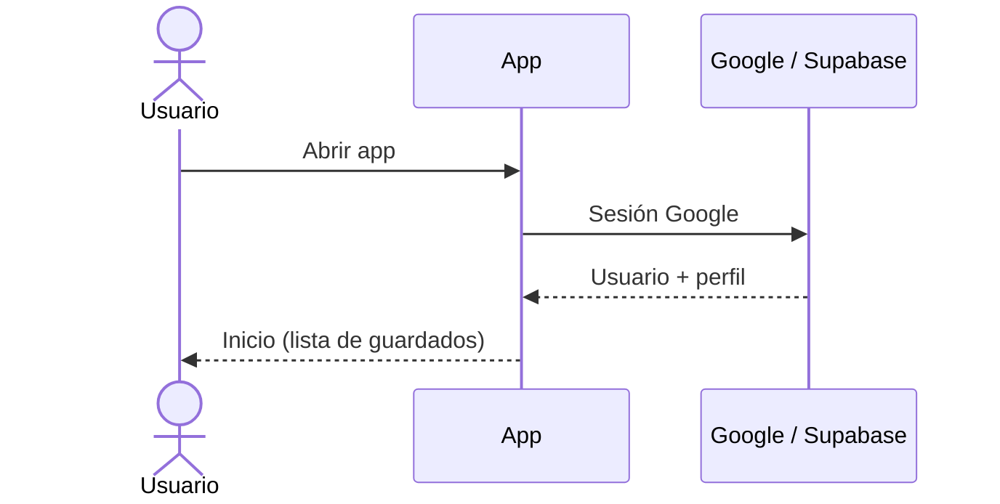
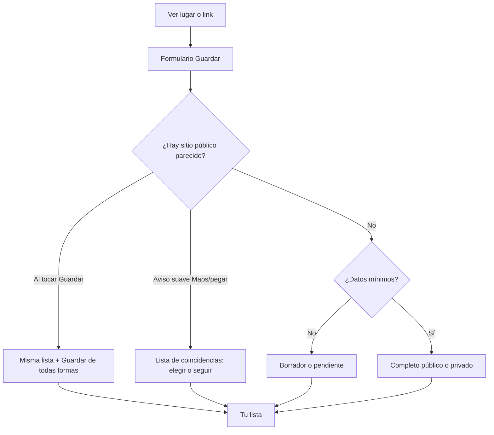
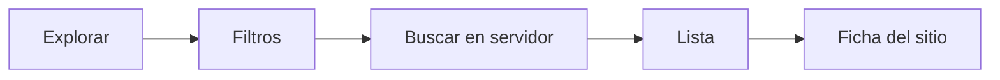
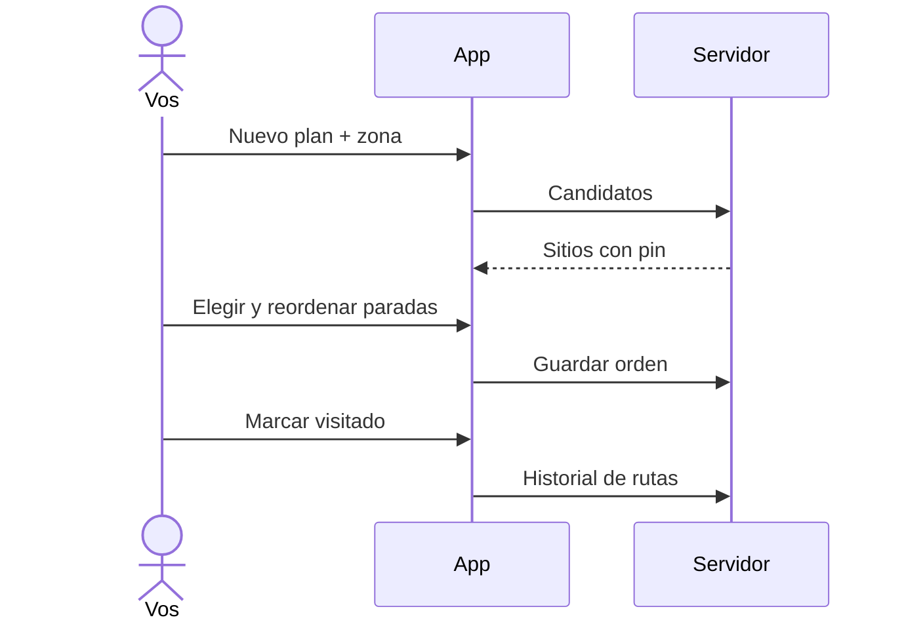
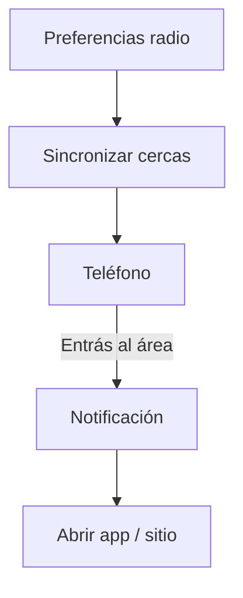
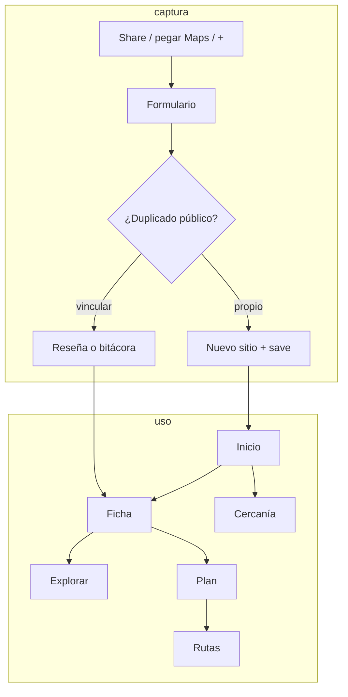

# Chevere Plan — lo que hace la app hoy

Documento de producto **según el código**. Solo lo que un usuario o admin puede hacer **ya**. Se actualiza en el **mismo cambio** que el código.

Qué no romper: [`invariantes.md`](invariantes.md).  
Estilo, pantallas y navegación (para Figma): [`ui-navegacion.md`](ui-navegacion.md).

---

## En una frase

Chevere Plan es una app Android para **guardar lugares** que ves en la vida o en redes, **evitar duplicados públicos**, **escribir reseñas o bitácoras**, **buscar** sitios (tuyos y públicos), **armar un plan de paradas** y **recordarte** cuando estás cerca de uno guardado.

Público y privado se distinguen por **color** (verde / morado) e **icono** en cada tarjeta. Las cards de sitio (Inicio, Explorar, anti-dupe, etc.) muestran siempre el icono de visibilidad más textos de origen **Tuyo** / **Catálogo** / **Público** / **Vinculado** (`SiteCardOriginRow`). «Público» como texto de origen solo si es público y no es tuyo ni de catálogo. El **tamaño de la tarjeta** en grilla se mantiene (ratios 2/3/4); la portada ocupa ≈**60%** de la altura (textos ≈40%). Si la card lleva CTA propios (anti-dupe: Ver ficha / Usar como), van en un pie compacto: los textos siguen ≈40% de la celda y la portada cede esa altura. En lista la fila mide **100** (`SiteCardListMetrics`: cabe origen, nombre 1 línea, depto–ciudad, dirección y meta); miniatura ≈**98%** (1 px arriba/abajo). Sin agrandar la card de grilla para “más foto”.

---

## Quién entra y con qué rol

1. Abrís la app → pantalla de **iniciar sesión con Google**.
2. El servidor crea un perfil (nombre de Google en privado, foto de Google guardada pero **no visible** por defecto, rol `usuario`). El **@usuario** y la foto pública se configuran en **Tu perfil** (menú ☰).
3. Un correo concreto queda como **root** al resetear la base (dueño del catálogo masivo). Hay también rol **admin**.
4. Admin y root entran al **panel** desde el menú **☰** de Inicio (Más opciones). Ahí también elegís el **tema**: Claro, Oscuro o Sistema (selector segmentado; se recuerda en el celular). Antes de **Cerrar sesión** se muestra la **versión** de la app (`x.y.z+build`). Reportes viven ahí. Sobre **contenido público** actúan casi como dueños. Las **bitácoras privadas no las ven**: solo quien las escribió.

---

## Mapa de la app (barra inferior)

| Sitio | Qué ves |
|---|---|
| **Inicio** | Saludo + título, menú **☰**, **Vista** (lista / 2 / 3 / 4), borradores si hay, **Eventos** (próximamente, se pliega), **Guardados recientes** y **Populares cerca** (misma vista; se pliegan), **acciones rápidas** (se pliegan). **Ver más** abre Explorar. Portada: foto o ilustración de categoría padre; borde verde/morado. |
| **Explorar** | Búsqueda de sitios (cabecera Figma, chips de **categoría padre multi-select**, lista o cuadrícula 2/3/4). Texto opcional; filtros avanzados (lugar, GPS+radio km, mis guardados). Transporte/presupuesto ocultos en UI. |
| **+ (centro)** | Guardar o completar un lugar (crear y editar son la **misma pantalla**) |
| **Planes** | Tus itinerarios (tarjeta de crear + lista; **un solo** CTA, sin FAB duplicado) |
| **Rutas** | Historial de paradas visitadas (stats del listado + timeline Make). Admin no vive acá |

Los tabs que ya abriste se quedan en memoria para que cambiar de pestaña se sienta instantáneo. Las listas pintan caché primero y refrescan detrás. Las fotos de portada que ya viste se reutilizan de disco (sin fade de “cargando”). Si una **sección** no carga, ves **Error en la app.** y el botón/enlace **Intenta de nuevo** (icono de refrescar) reintenta esa sección. Si falla **Guardar** (ya hay CTA abajo), solo un toast corto «Se ha presentado un problema.» — sin callout encima del botón. Nunca la palabra “failed”.

**Atrás en el shell:** si estás en Explorar, Planes o Rutas, el botón atrás vuelve a **Inicio**. En Inicio, el primer atrás muestra “Pulsa atrás otra vez para salir”; el segundo (en ~2 s) cierra la app. En fichas, guardar, mapas, etc. atrás sigue cerrando esa pantalla.

**Favoritos:** el corazón (cards de Inicio/Explorar y ficha del sitio) marca o quita el sitio en tu lista de favoritos. Relleno = está marcado. Hoy no hay pestaña ni filtro de favoritos; eso va en [`pendientes.md`](pendientes.md). No es lo mismo que “Tuyo” (tu guardado).

**Perfil (☰ → Tu perfil):** foto (usar Google / personalizada) y luego **@usuario** único (3–20, `a-z0-9._`; cambio como máximo cada **3 meses**; sin @ al abrir la app se fuerza la pantalla de perfil). Se muestra en reseñas, fotos, “Creado por” y el drawer — **no** el nombre del correo. Las relaciones (reseñas, fotos, sitios, favoritos) van por **id de perfil**, no por el @usuario.

---

## 1. Guardar un lugar

Es el corazón de la app.

### Cómo llega el lugar al formulario

- Botón **+**
- Reabrir un guardado incompleto desde Inicio
- **Compartir** un enlace desde otra app (Maps, Instagram, etc.): se intenta leer nombre, ciudad y coordenadas

Podés pegar un link de Maps **dentro del campo** (opción desde enlace / icono pegar): la app rellena nombre, ciudad y **pin**. Eso cuenta como lugar ya elegido: **no** se pregunta “¿punto exacto?” ni se tiran las coordenadas. **Público** queda habilitado si hay pin. El mapa interactivo tampoco pregunta: el usuario ya confirmó el punto.

Se guardan **las dos** ubicaciones: el **lugar** (nombre y Place ID) y el **punto exacto** (lat/lng). El interruptor va apagado si solo pegás un enlace o si elegís una **ficha de lugar** en el mapa (parque, tienda…). **Confirmar solo un pin en el mapa** lo enciende. Encendido: Maps abre con `query=lat,lng` (coords en el buscador), no el nombre ni el Place ID. Apagarlo no borra el pin ni Público. Contrato: [`invariantes.md`](invariantes.md).

En el **mapa interactivo**, Confirmar / Usar empieza **desactivado** (centro de Colombia no cuenta). Se activa al buscar, tocar el mapa, arrastrar el pin o usar GPS. Al tocar, además del pin aparecen chips de lugares cercanos (Places Nearby) para guardar la **ficha** del sitio.

### Qué ves en el formulario

Siempre visible al **crear** (vacío): **Ubicación** (tres pestañas: Mapa, Enlace, Cámara; debajo el interruptor de punto exacto). **Nombre** (con lugar físico + público en la misma card) va en **Añadir sección** como chip `+ Nombre - Visibilidad`; se abre sola cuando el autocompletado de ubicación rellena el nombre, o al tocar el chip. Al **compartir** desde una red social (no enlace Maps), **Nombre** y **Enlaces** se abren de inmediato, haya o no autocompletado. Al **editar** o completar borrador: todas las secciones visibles.

El resto va detrás de **Añadir sección**: chips `+` (**Nombre - Visibilidad**, **Detalles**, **Enlaces**, **Categorías**, **Fotos**). Los que ya están abiertos dejan de mostrarse como chip. **Guardar** es un botón ancho **abajo** (un solo CTA; no está en el AppBar).

- Al **crear**, se asume lugar físico y privado; los interruptores van en la card de nombre cuando está abierta.
- Al **editar** o completar un borrador: se muestran **todas** las secciones.
- **Fotos** (sección extra): miniaturas de las ya guardadas (al editar) y de las nuevas elegidas (con ✕); las nuevas se guardan en memoria al elegirlas (no dependen de archivos temporales). Hasta 15.
- Al **compartir** desde otra app (red social): se abren **Nombre** y **Enlaces**; Maps solo precarga ubicación/enlace.
- Ayuda: icono **i** (tooltip al toque), no párrafos bajo cada campo.
- Categorías: árbol de la base; al **crear**, default **Otros**; al **editar** no se pisa lo que ya tenía.
- Sin nombre no se puede guardar (el botón queda desactivado). Sin ubicación el guardado puede quedar en borrador.

### Estados del guardado

- **Borrador**: faltan cosas (p. ej. lugar físico sin pin y sin categoría clara)
- **Pendiente de ubicación**: hay categoría explícita pero aún no hay coordenadas
- **Completo**: categoría + (si es físico) coordenadas

Si el lugar físico **no tiene punto en el mapa**, en la ficha y en Guardar sitio se muestra una **advertencia**: no entra en Explorar, planes, rutas ni recuerdos cercanos hasta asignar el pin. Tras guardar sin pin, el diálogo lo repite. En Inicio, el aviso de borradores usa la misma idea.

Los borradores viejos avisan en Inicio. Hay recordatorios locales espaciados (24 h / 3 días / 7 días) con **tarjeta estándar** (nombre, depto–municipio, foto de portada si hay) hasta que completes o descartes. Tocar abre el formulario de edición.

---

## 2. Anti-duplicados (capa pública)

La app no quiere dos fichas públicas del mismo parque a 80 metros.

- Busca sitios **públicos completos** y **tus privados completos** (con pin): mismo Place ID, pin cercano (radio configurable, **default 100 m**; ☰ → **Mismo sitio al guardar**, siempre en metros), nombre parecido en un radio fuzzy (~5×), o misma ciudad + nombre. **No** entran borradores propios (sin ubicación / incompletos).
- Tras un **reset completo** el catálogo masivo vuelve: si el pin/nombre coincide, **sí hay un sitio real** (no es caché fantasma). Abrir la fila debe mostrar esa ficha; **Guardar de todas formas** crea el tuyo aunque el aviso siga saliendo.
- **Aviso suave** al pegar Maps o elegir pin: grilla 2×2 (mismo estándar de tarjeta: portada, franja de visibilidad, icono público/privado, Tuyo/Catálogo/Público/Vinculado, nombre, depto–ciudad, dirección). **Ver ficha** como enlace de texto; **Usar como** azul; seleccionado: fondo surface + borde foreground (tema claro/oscuro). Al usarlo: **Reseña pública** (solo si el sitio es público), **Reseña privada** o **Agregar a favoritos**; info con Tooltip; al **Confirmar** se descarta el guardado y navega a la ficha. Abajo **Seguir con el mío**.
- **Al Guardar**: misma grilla; abajo **Guardar de todas formas** (Tooltip aparte). Botón **Guardar** amarillo si hay coincidencias.
- Reseña pública solo en sitios públicos; reseña privada y favoritos en cualquiera de la lista.
- El sitio de catálogo masivo (`external_id`) **no se vuelve privado**.

Staff/admin **no** ve bitácoras ajenas privadas.

---

## 3. Ficha del sitio

Tres pestañas: **info**, **reseñas**, **más** (quién lo creó, catálogo, fechas, “también lo guardaron”).

En info: nombre, visibilidad por color/icono (hero con franja), ciudad, pin, abrir/cómo llegar en Google Maps, categorías, precio, notas, fotos en tira (si ya viste la portada en Inicio, aparece al toque; el resto se completa atrás). Tocar abre el visor. En pantalla completa: quién la subió, **fecha** `dd/mmm/aaaa` (sin hora), menú ⋮ (portada / eliminar / reportar), swipe. Enlaces. En el header, corazón de **favorito** (igual que en las cards). **No** hay “agregar a un plan” en esta ficha.

Editar: creador, quien lo tiene en su lista como propio, o staff sobre **público**.

Pasar de público a privado se bloquea si otros lo usan (otros guardados, aportes, paradas de plan) o si es catálogo.

---

## 4. Reseñas y bitácoras

En un sitio **público**:

- **Reseña pública**: texto, estrellas, hasta 3 fotos (cualquier usuario logueado las ve en sitio público). Varias por persona a lo largo del tiempo. El promedio usa solo las públicas. Tocar una foto abre el **mismo visor** que las del sitio (autor, fecha `dd/mmm/aaaa`, ⋮ eliminar/reportar; sin “usar como portada”). Si hay varias en la reseña, se navega entre ellas. En la tarjeta, ⋮ **Reportar** (reseñas ajenas públicas; un reporte por usuario).
- **Bitácora privada**: mismo formulario, solo el autor la lee. Admin **no**. Misma UI de fotos al ampliar. No se reportan (solo las ve el autor).

Reportar foto o reseña pública inadecuada: el primer reporte avisa a staff (lista de reportes abiertos, con vista previa del texto en reseñas). Staff puede quitar la foto o la reseña; borrar el archivo en Storage al cerrar el reporte aún es deuda.

---

## 5. Explorar (búsqueda)

Filtros (AND): texto (opcional; solo busca con lupa/Enter; **X** limpia el campo), panel **avanzado** en tarjeta (lugar, mis guardados, GPS + radio en la **unidad de distancia** del usuario), luego categorías. Multi-categoría **opcional** (checkbox “Varias categorías”, off = una sola). Reset (`filter_alt_off`) borra filtros/resultados y descarta búsquedas en curso. Transporte/presupuesto ocultos. Radio de Explorar en SharedPreferences (canon km); reset vuelve a recuerdos cercanos (m→km). La etiqueta del radio usa la unidad preferida (default **km**).

Paginación cliente: **15** por “Cargar más” (`SearchPolicies.pageSize`). Resultados: tuyos, públicos, catálogo o vinculados. Vista lista / 2 / 3 / 4 (misma que Inicio).

Atajos de Inicio → Explorar: primero **cancelan** la búsqueda en curso y **resetean** filtros, luego aplican solo el atajo (**Cerca de mí**, **Mis guardados**, **Mis favoritos**, **Por categoría**). GPS usa last-known y luego low/3s. Caché SWR solo si la clave de filtros coincide; **Mis guardados** / **Mis favoritos** siempre van a red. Al guardar, descartar o marcar favorito se invalidan las claves `search:*` para que Explorar no quede con resultados viejos.

El filtro de “horario” en la UI **no recorta** resultados reales todavía (los sitios no tienen horarios de apertura cargados).

---

## 6. Planes

1. Crear o **editar** plan: misma pantalla (título, zona, públicos, tope de presupuesto). Al crear, sigue el armado de paradas. Al editar (⋮ en el detalle) guarda y vuelve. Hay una fila “IA” que abre **en construcción** (no arma el plan sola).
2. El servidor propone **candidatos** de tus guardados (y públicos si marcaste).
3. Armás paradas. En la lista “añadidos” y en el detalle, con **2+ paradas**, arrastrás el orden; se guarda.
4. Detalle (look Figma): portada, stats de paradas/presupuesto/zona, itinerario, **Llevar a Maps**, compartir y `+` en la misma barra. Seguir: abrir ficha, marcar visitado (pasa a **Rutas**), reordenar. El `+` agrega sitios. No hay transporte inventado en stats. **Llevar a Maps** abre al toque con la última posición conocida (no espera un GPS fino ni recarga todas las paradas). Origen = GPS; cada destino = **nombre** del sitio (no el centroide DIVIPOLA). Si el sitio tiene **Punto exacto**, ahí sí manda lat/lng.
5. Transporte “sugerido por distancia” está **parametrizado en admin** (tipos y km), pero **la app no calcula aún** el medio: la fila abre la pantalla **en construcción**.

---

## 7. Rutas

Lista de paradas que marcaste hechas (sitio, plan, fecha). Sirve como “ya pasé por aquí”, no es un GPS grabando el trayecto.

---

## 8. Cercanía (“recuerdos”)

En **Más opciones (☰)** → **Recuerdos cercanos** abrís la hoja de radio (límites internos 100–2000 m) y si querés que cuenten **sitios públicos** además de los tuyos. El slider y las etiquetas usan la **unidad de distancia** del usuario (default **km**; también m, mi u otras del catálogo admin). Ya no hay banner de recuerdo en el feed de Inicio.

En **Más opciones** → **Unidad de distancia** elegís cómo se muestran km/millas en recuerdos cercanos, Explorar y etiquetas. El radio de **Mismo sitio al guardar** (anti-dupe) es la excepción: siempre en **metros**. El administrador define las unidades activas (panel Admin → Distancias). Interno: proximidad en metros, búsqueda en km.

El teléfono registra geocercas (tope práctico ~100, priorizando los tuyos). Si entrás al radio, notificación tipo **tarjeta recuerdo** (foto de portada si hay, nombre, departamento–municipio, «Lugar cerca de ti»). Mismo formato que borradores / futuros eventos y resúmenes. Pedir ubicación “siempre” y el gasto de batería aún se pueden pulir.

**Populares cerca** (Inicio) usa la misma idea de “celda”: guarda los públicos **de otros** (no los tuyos; esos solo van en Guardados recientes) del radio de 25 km junto con el punto GPS. Al volver a Inicio pinta esa lista al toque. Solo vuelve a consultar GPS fino + búsqueda si te moviste más de ~2 km (el tope de radio de recuerdos), si la caché tiene más de 24 h, o si deslizás para refrescar.

En Inicio, arriba de **Guardados recientes**, elegís **lista** o **cuadrícula de 2, 3 o 4**; vale para recientes y populares (y Explorar usa la misma preferencia). Las secciones se **pliegan** tocando el título. **Ver más** abre **Explorar**.

Las cards/listas muestran **nombre**, **departamento - municipio** y **dirección** si hay. Si el texto no cabe en el alto de la tarjeta, esa zona hace **scroll**.

Sin foto: ilustración de la **categoría padre** (`SiteLookCover`), la misma en Inicio, Explorar, **Planes** (la card usa el primer sitio) y Rutas. Con fotos: encabezado = **portada**. La primera foto se guarda como portada; las siguientes no la pisan. En el visor, ⋮ → usar como portada. Esa misma foto va en tarjetas y listas.

---

## 9. Admin y moderación

Solo staff. Entrás por **Más opciones (☰)** en Inicio → Panel administrador / Reportes.

- **Categorías**: árbol, keywords para autocomplete, activar/desactivar, +18.
- **Tipos de transporte**: grupo (particular / público / otro), km máximos por defecto, icono.
- **Reportes abiertos**: fotos y **reseñas** (y tipos previstos sitio/perfil/evento). En reseñas se muestra el sitio y un recorte del texto.

No hay panel de “tarifas de bus por ciudad” ni generación de plan por IA.

---

## 10. Catálogo de Colombia

Departamentos y ciudades vienen de **DIVIPOLA** (DANE), no de listas en la app. Al guardar, Maps puede sugerir texto; la app **casa** eso con el catálogo y guarda **ids**.

El reset completo vuelve a cargar un **JSON masivo** de sitios públicos de Colombia (dueño = cuenta root). Esos sitios alimentan búsqueda, anti-dupe y planes si incluís públicos.

---

## 11. Privacidad (reglas reales)

| Cosa | Quién la ve |
|---|---|
| Sitio privado | Autor (y staff no entra a bitácoras privadas) |
| Sitio público | Cualquier usuario logueado; staff puede editar |
| Guardado / notas / link original | Solo el dueño del save |
| Reseña pública | Quien puede ver el sitio público |
| Bitácora privada | Solo el autor |
| Catálogo masivo | Público; no se privatiza |

Errores en pantalla: en secciones sin CTA propio, *«Error en la app.»* + **Intenta de nuevo**. En Guardar (ya hay botón), toast «Se ha presentado un problema.». Nunca SQL ni claves.

---

## 12. Qué **no** hace hoy (aunque el spec viejo lo mencione)

- Compartir plan con un link
- Validar horarios de apertura al armar el plan
- Sugerir bus/bici/carro en cada tramo
- Exportar el plan a Google Maps desde el menú
- IA que “arme un plan para mañana”
- Monetización, eventos, fichas de negocio de pago
- iOS como producto (el código es Flutter; el uso diario es Android)
- Menores de 18 filtrados de forma estricta en toda la app (hay categorías +18 en datos; no hay flujo de edad completo)

Esos huecos viven en [`pendientes.md`](pendientes.md).

---

## Flujos de extremo a extremo (resumen)

---

## Datos que la app trata como “la verdad”

- Categorías y transporte: **base de datos** + caché larga (24 h / 7 d). Listas vacías **no** se guardan en caché; si falla la carga, la app borra la caché y reintenta desde Supabase (Guardar sitio muestra «Intenta de nuevo» en la sección Categorías).
- Geografía: **DIVIPOLA** + caché 30/90 días
- Sitios, saves, planes, reseñas: servidor; la app muestra caché y confirma después
- **Populares cerca:** Hive + ancla GPS; nueva red solo si te salís ~2 km, pasaron 24 h, o tirás a refrescar Inicio
- Fotos: Storage privado; sitio público/propio, o **reseña pública** en sitio visible (además del dueño del path / staff)

---

## Pruebas cerradas (APK)

- Portal público (GitHub Pages): `https://johntibagan.github.io/chevere_plan/` — versión + descarga + reportes anónimos. Cada reporte tiene un consecutivo corto (`#1`, `#2`…) para commits (tocar copia). El dueño (PIN) puede marcar **en revisión**: el público ya no edita ni borra ese ítem. Al final, **Cómo probar**: desplegables por versión con el flujo de cada `#` (tabla `beta_qa_flows`). Al decir **publica** en el chat, el agente pide los IDs y escribe esos flujos. Deploy de Pages: workflow `beta-portal-pages` en runner **self-hosted** (WSL); solo si cambia `beta-portal/`.
- Secrets en GitHub Actions: `BETA_SUPABASE_URL`, `BETA_SUPABASE_ANON_KEY` (nunca la service_role).
- APK en Supabase Storage (`beta-apks`). Publicar: `frontend/tool/publish_beta.ps1` (bump `+N`, release **arm64 sin R8** — evita crash al abrir en beta; ~25–35 MB, subida TUS + `beta_release`). El portal lo lee; no hace falta redeploy de Pages. Plan Free ≤ 50 MB. Para vos en USB: `flutter run --release --dart-define-from-file=.env`.
- Versionado en `frontend/pubspec.yaml` (`1.0.0+N` en beta: solo sube el número tras el `+`). PIN de dueño para marcar reportes: tabla `private.beta_admin` (default `chevere`).

