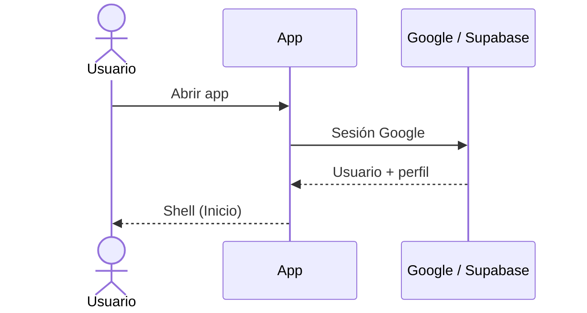
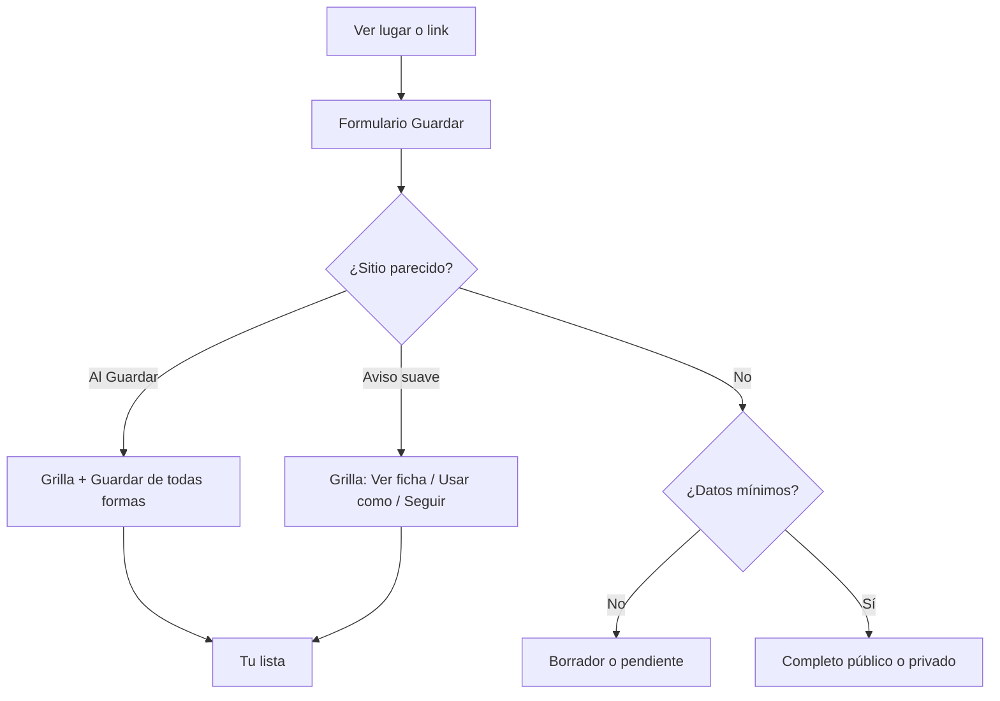
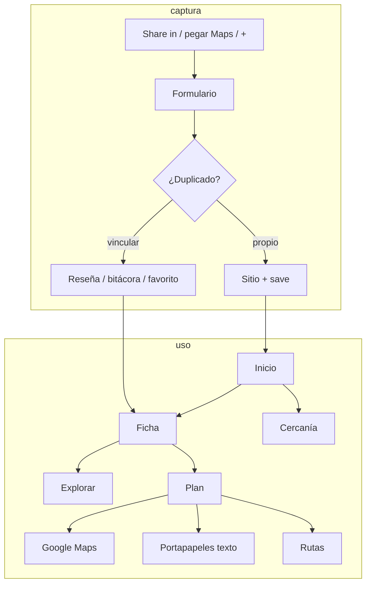

# Chevere Plan — lo que hace la app hoy

Documento de producto **según el código**. Solo lo que un usuario o admin puede hacer **ya**. Se actualiza en el **mismo cambio** que el código.

Visión / fases: [`producto.md`](producto.md) (MVP vivo en §1bis).  
Qué no romper: [`invariantes.md`](invariantes.md).  
UI / Figma: [`ui-navegacion.md`](ui-navegacion.md).  
Dudas de **compartir** (abiertas / cerradas): [`pendientes.md`](pendientes.md) → *Compartir sitios y planes*.

---

## En una frase

Chevere Plan es una app Android para **guardar lugares** (y tarjetas no físicas), **evitar duplicados públicos**, **reseñar o llevar bitácora**, **buscar** sitios (tuyos, públicos, favoritos), **armar planes de paradas**, **llevarlos a Google Maps**, **recordarte** cuando estás cerca, y (planes) **copiar un resumen al portapapeles**. **No** hay aún compartir ficha de sitio ni link profundo de plan.

### Señales en tarjetas (lista y grilla)

- **Color + icono** de visibilidad: verde/público, morado/privado (sin repetir la palabra al lado del icono si ya hay franja/borde).
- Origen: **Tuyo**, **Tarjeta**, **Catálogo**, **Público** (solo si es público y no tuyo ni catálogo), **Vinculado**.
- Portada ≈ **55%** / textos ≈ **45%** en grilla (`SiteCardGridMetrics` coverFlex 11 / textFlex 9). Si el texto de lugar no cabe, **scroll interno** (`SiteCardScrollablePlaceTexts`) — no se corta a ciegas ni desborda la celda.
- Lista: fila fija **104** (`SiteCardListMetrics`); miniatura ≈98% de alto; fila de origen **24**; corazón icono **24×24**.
- Corazón = **favorito** (no es “Tuyo”).

---

## Quién entra y con qué rol

1. Abrís la app → **iniciar sesión con Google** + aceptación de legales (textos borrador).
2. El servidor crea perfil: nombre Google en privado; foto Google guardada pero **no visible** hasta que elijas usarla; rol `usuario`.
3. **@usuario** (3–20, `a-z0-9._`) y avatar se configuran en **Tu perfil**. Sin @, al abrir Inicio se fuerza el perfil. Cambio de @ como máximo cada **90 días**.
4. Un correo concreto es **root** tras reset de base (dueño del catálogo masivo). Hay rol **admin**.
5. Staff (admin/root): menú → Panel / Reportes. Sobre **contenido público** actúan casi como dueños. **Bitácoras privadas ajenas: no las ven.**

---

## Mapa de la app (barra inferior)

| Sitio | Qué ves |
|---|---|
| **Inicio** | Saludo + título, **foto de perfil** (menú), **Vista** lista/2/3/4, borradores, **Eventos** (próximamente, plegable), **Guardados recientes** (solo físicos, plegable), **Populares cerca**, **acciones rápidas** (plegable; se pueden **fijar** sobre el menú). **Ver más** → Explorar. Tarjetas no físicas: **☰ → Tarjetas**. |
| **Explorar** | Misma foto de perfil. Búsqueda de sitios: query, chips categoría (multi opcional), avanzado (lugar, GPS+radio en unidad del usuario, mis guardados, mis favoritos). Transporte/presupuesto **ocultos**. Conteo + Vista **fijos** bajo categorías. Paginación servidor **15**. |
| **+ (centro)** | Guardar / editar sitio (misma pantalla). |
| **Planes** | CTA crear + lista de planes (sin FAB duplicado). |
| **Rutas** | Historial de paradas visitadas. |

Tabs ya abiertos quedan en memoria (`IndexedStack`). Listas: caché primero, red detrás. Errores de sección: **Error en la app.** + **Intenta de nuevo**. Fallo de Guardar: toast «Se ha presentado un problema.» (sin callout sobre el CTA).

**Atrás:** en Explorar/Planes/Rutas → Inicio. En Inicio → “pulsa otra vez para salir”. En pantallas apiladas → pop.

**Menú (foto / ☰):** Tu perfil · Tarjetas · Recuerdos cercanos · Mismo sitio al guardar (m) · Unidad de distancia · Tema (Claro/Oscuro/Sistema) · Admin/Reportes (staff) · versión · Cerrar sesión. Con gestos del sistema, el drawer **no** se abre por borde; solo con la foto.

**Favoritos:** corazón en cards y ficha. **Sí hay** filtro **Mis favoritos** en Explorar avanzado y atajo desde Inicio. **No** hay pantalla “Mis favoritos” dedicada ni uso en ranking de planes.

**Perfil:** se muestra **@usuario** (y avatar elegido) en reseñas, fotos, “Creado por”, drawer — **no** el nombre del correo. Relaciones por **id de perfil**.

---

## 1. Guardar un lugar

Corazón de la app. Crear y editar = **misma pantalla**.

### Cómo llega el lugar

- FAB **+**
- Borrador desde Inicio
- **Compartir entrante** del SO (Maps, IG, TikTok, etc.) → parseo → formulario
- Pegar link Maps en pestaña Enlace (solo al **crear**)

Pegar / share Maps = lugar ya elegido: se conservan coords; **Público** habilitado si hay pin. No se pregunta “¿punto exacto?” ni se anulan coords.

Se guardan **lugar** (nombre / Place ID) y **punto exacto** (lat/lng). Interruptor **Punto exacto** apagado por defecto (ficha vs pin en Maps). Encenderlo sin pin abre el mapa. Apagar no borra coords ni Público.

Mapa interactivo: Confirmar desactivado hasta buscar / tocar / arrastrar / GPS. Chips Nearby para ficha de lugar.

### Formulario

**Crear vacío, físico:** Ubicación (Mapa / Enlace / Cámara + punto exacto) siempre; Nombre+visibilidad detrás de **Añadir sección** (se abre sola si Maps autocompleta nombre).  
**Crear no físico:** sin mapa; banner tarjeta; Nombre+visibilidad.  
**Share social (no Maps):** Nombre + Enlaces abiertos de inmediato.  
**Editar / borrador:** todas las secciones; ubicación solo si sigue físico; **sin** pegar enlace Maps.

Chips **Añadir sección:** Nombre-Visibilidad, Detalles, Enlaces, Categorías, Fotos.  
**Guardar:** CTA ancho **abajo** (único).  
Categorías: árbol DB; default **Otros** solo al crear.  
Sin nombre → Guardar deshabilitado.  
Dirty: cualquier toque → ¿Descartar cambios? al salir (`FormDirtyTracker` + `AppConfirmDialog`).

### Estados

- **Borrador** / **Pendiente de ubicación** / **Completo**
- Físico sin pin: advertencia (no entra Explorar/planes/rutas/cercanía)
- Tarjeta no física: mismo tipo de exclusión; origen **Tarjeta**; lista en ☰ → Tarjetas
- Recordatorios locales de borrador (24 h / 3 d / 7 d) con tarjeta estándar

---

## 2. Anti-duplicados

- Busca públicos **completos** y **tus** privados completos con pin: Place ID, radio (preferencia **m**, default **100**, rango 50–1000), fuzzy nombre, ciudad+nombre. No borradores sin pin.
- Catálogo post-reset: si coincide, es sitio real.
- **Aviso suave** (Maps/pin): grilla 2×2 estándar; Ver ficha; Usar como → reseña pública (solo si público) / privada / favorito; Confirmar descarta el draft y abre ficha; Seguir con el mío.
- **Al Guardar:** misma grilla + **Guardar de todas formas**; CTA Guardar en amarillo si hay matches.
- Catálogo (`external_id`) **no se privatiza**.

---

## 3. Ficha del sitio

Tabs: **Info**, **Reseñas**, **Más** (creador, catálogo, fechas, también lo guardaron).

Info: nombre, franja/icono visibilidad, origen, ciudad, pin, Maps (abrir / cómo llegar), categorías, precio, notas, fotos en tira → visor fullscreen (autor, fecha `dd/mmm/aaaa`, ⋮ portada/eliminar/reportar). Corazón favorito en header. **Sin** “agregar a plan” ni **compartir ficha**.

Editar: creador, quien lo tiene como propio en saves, o staff sobre público.

**Público → privado:** bloqueado si catálogo o vínculos **de otros usuarios** (no el dueño): saves, aportes, paradas en planes ajenos, reseñas públicas (`site_privacy_blockers`); la app muestra el motivo concreto en un diálogo.

---

## 4. Reseñas y bitácoras

Sitio **público**:

- **Reseña pública:** texto, 1–5★, hasta 3 fotos; varias por usuario; promedio solo públicas; reportable.
- **Bitácora privada:** mismo form; solo el autor; no reportable por otros.

Visor de fotos de reseña = mismo que sitio (sin “usar como portada”). Staff: bandeja de reportes; borrar archivo Storage al cerrar reporte aún puede faltar.

---

## 5. Explorar (búsqueda)

- Query opcional (lupa/Enter; X limpia). Chips de categoría padre; checkbox **Varias categorías**.
- Avanzado: ubicación texto, **usar mi ubicación** + radio (unidad preferida; persistido en km), **mis guardados**, **mis favoritos**.
- Reset filtros (`filter_alt_off`).
- **Paginación servidor:** `p_limit=15`, `p_offset`; Cargar más concatena; si página &lt; 15, se oculta el botón. Orden estable: distancia → nombre → id.
- Fila **N resultados + Vista** fija bajo categorías.
- Atajos Inicio: cancelan búsqueda en curso, resetean filtros, aplican Cerca de mí / Mis guardados / Mis favoritos / Por categoría.
- Mis guardados / favoritos: siempre red fresca. Invalidación `search:*` al guardar/descartar/favoritar.
- Filtro horario UI: **placeholder** (no hay horarios cargados en sitios).

---

## 6. Planes

1. Crear/editar: título, zona, incluir públicos, tope presupuesto. Card IA → “en construcción”.
2. Candidatos (tuyos + públicos si aplica) → armar paradas → reordenar (2+).
3. Detalle: portada primer sitio, stats, itinerario, **Llevar a Maps**, icono compartir, `+` paradas, marcar visitado → **Rutas**.
4. **Llevar a Maps:** al toque; origen = última ubicación conocida; destinos = **nombre** del sitio (lat/lng solo si punto exacto).
5. **Compartir plan:** **oculto en UI** hasta Fase 2 (compartir por @usuario; ver [`pendientes.md`](pendientes.md)). La lógica de portapapeles sigue en código pero no se muestra. **No** genera link ni invite.
6. Transporte sugerido por tramo: UI “en construcción” (tipos sí existen en admin).

---

## 7. Rutas

Lista de paradas marcadas visitadas (sitio, plan, fecha). No graba el trayecto GPS.

---

## 8. Cercanía (“recuerdos”)

☰ → Recuerdos cercanos: radio 100–2000 m (default 200) en **unidad de distancia** del usuario; switch incluir públicos.

☰ → Unidad de distancia: catálogo admin (default km).  
☰ → Mismo sitio al guardar: radio anti-dupe **siempre en metros**.

Geocercas (~100 tope práctico). Notificación tarjeta (portada, nombre, depto–ciudad).

**Populares cerca:** públicos de otros en ~25 km; caché ancla GPS; refetch si &gt;~2 km, &gt;24 h o pull-to-refresh.

---

## 9. Admin y moderación

☰ → Panel / Reportes (staff).

- Categorías (árbol, keywords, activo)
- Transporte (grupo, km default, icono)
- Unidades de distancia
- Reportes abiertos (fotos, reseñas; tipos sitio/perfil/evento previstos)

No: tarifas bus/ciudad, IA de planes, cobros, eventos pagos.

---

## 10. Catálogo de Colombia

DIVIPOLA (deptos/ciudades) en DB + caché larga.  
Reset `--full`: JSON masivo de sitios públicos (owner root) → Explorar, anti-dupe, planes con públicos.

---

## 11. Privacidad y “salida” de datos (matriz)

| Cosa | Quién la ve en app | Cómo puede “salir” hoy |
|---|---|---|
| Sitio privado | Dueño | No share ficha; no Explorar ajeno |
| Sitio público | Usuarios logueados | Explorar / anti-dupe / planes; **sin** URL pública anónima ni Share OS de ficha |
| Catálogo | Como público | No privatizable |
| Save / notas / link original | Dueño del save | No en ficha comunitaria |
| Reseña pública | Quienes ven el sitio | Ficha; reportes |
| Bitácora privada | Solo autor | Nunca staff/otros |
| Plan | Solo dueño | Clipboard texto (nombres de **todas** las paradas del plan); Maps intent |
| Favorito | Relación privada | — |

Errores UI: callout de sección o toast de Guardar; nunca SQL/stacks.

**Hoy:** sin share de ficha; plan = compartir **oculto** (Fase 2: @usuario).

---

## 12. Qué **no** hace hoy (relevante a producto)

- Compartir **ficha de sitio** (privado o público) por hoja del sistema o link
- Compartir **plan por link** / invite / plan colaborativo (solo texto al portapapeles)
- Validar horarios de apertura al armar plan o filtrar Explorar
- Sugerir medio de transporte por tramo
- IA que arma un plan
- Lista dedicada “Mis favoritos” / favoritos en ranking de planes
- Monetización, eventos reales, fichas de negocio de pago
- iOS como producto publicado
- Búsqueda de **planes** por título (solo sitios)

Visión y fases: [`producto.md`](producto.md). Deuda menor: [`pendientes.md`](pendientes.md).

---

## Flujos de extremo a extremo

---

## Datos “verdad”

- Categorías / transporte / unidades: DB + caché larga  
- Geografía: DIVIPOLA + caché 30/90 d  
- Sitios, saves, planes, reseñas, favoritos: servidor; SWR en cliente  
- Populares cerca: Hive + ancla GPS  
- Fotos: Storage; firmadas; decode acotado al tamaño de celda en cards  

---

## Pruebas cerradas (APK)

- Portal: `https://johntibagan.github.io/chevere_plan/` — versión, APK, reportes (`#N`), Cómo probar (`beta_qa_flows`).  
- Al decir **publica** en chat: IDs + versión → flujos en DB.  
- APK en Storage `beta-apks`; ver `beta-portal/README.md` (publicar).  
- Versionado `pubspec` `1.0.0+N`. PIN admin beta en `private.beta_admin`.
