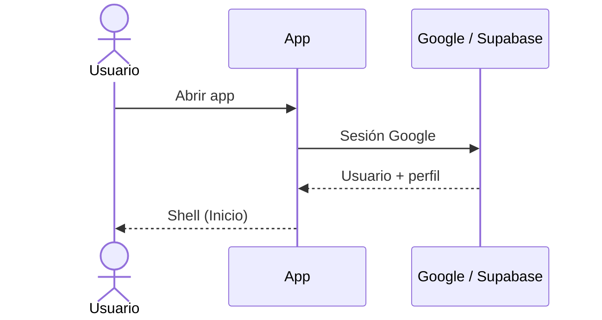
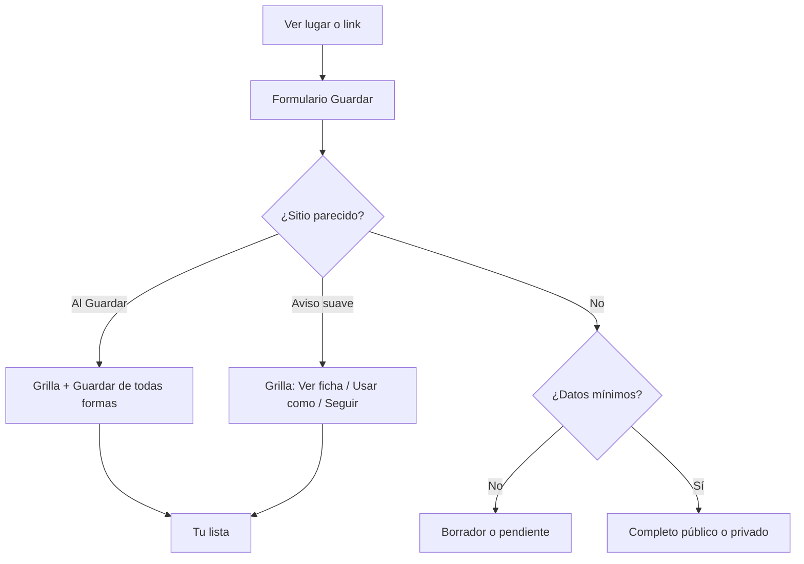
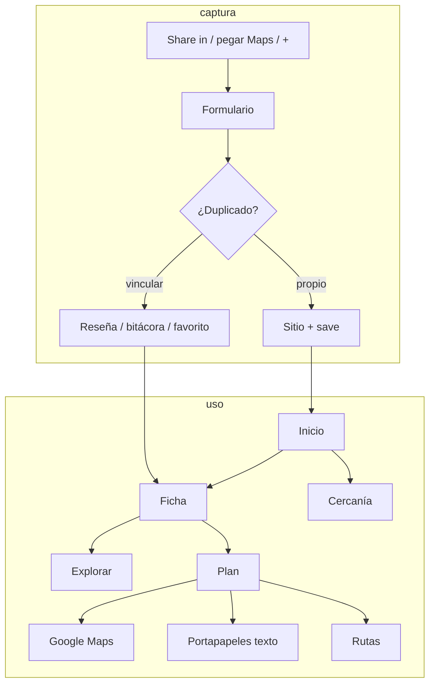
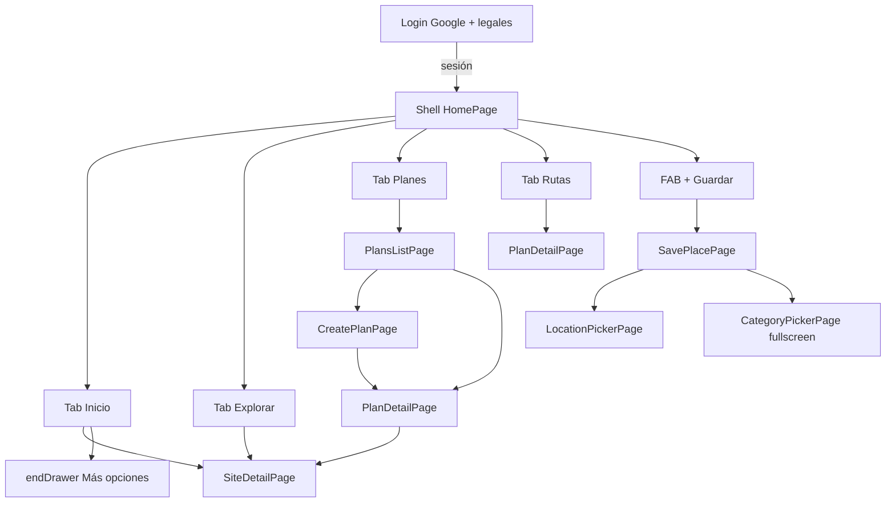

# Chevere Plan — estado actual (producto + UI)

**Un solo documento** según el código: qué hace la app y cómo se ve / navega. Actualizar en el **mismo pase** que el cambio.

| Tema | Dónde |
|---|---|
| Visión / fases | [`producto.md`](producto.md) |
| Qué no romper | [`invariantes.md`](invariantes.md) |
| Compartir (abierto/cerrado) | [`pendientes.md`](pendientes.md) → *Compartir sitios y planes* |
| Figma Make (snapshot) | [`design/figma-make/`](../design/figma-make/README.md) |

**Marca:** Chevere Plan (`com.chevere.plan`). El Make a veces dice “Chebre Plan” — usar **Chevere Plan**.

---

## Parte I — Producto y flujos

### En una frase

Chevere Plan es una app Android para **guardar lugares** (y tarjetas no físicas), **evitar duplicados públicos**, **reseñar o llevar bitácora**, **buscar** sitios (tuyos, públicos, favoritos), **armar planes de paradas**, **llevarlos a Maps** (chooser: Google Maps · Waze · Uber), **recordarte** cuando estás cerca, y (planes) **copiar un resumen al portapapeles**. **No** hay aún compartir ficha de sitio ni link profundo de plan.

Tarjetas, tokens, medidas y pantallas: **Parte II**.

### Quién entra y con qué rol

1. Abrís la app → **iniciar sesión con Google** + aceptación de legales (textos borrador).
2. El servidor crea perfil: nombre Google en privado; foto Google guardada pero **no visible** hasta que elijas usarla; rol `usuario`.
3. **@usuario** (3–20, `a-z0-9._`) y avatar se configuran en **Tu perfil**. Sin @, al abrir Inicio se fuerza el perfil. Cambio de @ como máximo cada **90 días**.
4. Un correo concreto es **root** tras reset de base (dueño del catálogo masivo). Hay rol **admin**.
5. Staff (admin/root): menú → Panel / Reportes. Sobre **contenido público** actúan casi como dueños. **Bitácoras privadas ajenas: no las ven.**



### Mapa de la app (barra inferior)

| Sitio | Qué ves |
|---|---|
| **Inicio** | Saludo + título, **foto de perfil** (menú), **Vista** lista/2/3/4, borradores, **Eventos** (próximamente, plegable), **Guardados recientes** (solo físicos, plegable), **Populares cerca**, **acciones rápidas** (plegable; se pueden **fijar** sobre el menú). **Ver más** → Explorar. Tarjetas no físicas: **☰ → Tarjetas**. |
| **Explorar** | Misma foto de perfil. Búsqueda de sitios: query, chips categoría (multi opcional), avanzado (lugar, GPS+radio en unidad del usuario, mis guardados, mis favoritos). Transporte/presupuesto **ocultos**. Conteo + Vista **fijos** bajo categorías. Paginación servidor **15**. |
| **+ (centro)** | Guardar / editar sitio (misma pantalla). |
| **Planes** | FAB **Crear plan** (abajo derecha) + lista. |
| **Rutas** | Historial de paradas visitadas. |

Tabs ya abiertos quedan en memoria (`IndexedStack`). Listas: caché primero, red detrás. Errores de sección: **Error en la app.** + **Intenta de nuevo**. Fallo de Guardar: toast «Se ha presentado un problema.» (sin callout sobre el CTA).

**Atrás:** en Explorar/Planes/Rutas → Inicio. En Inicio → “pulsa otra vez para salir”. En pantallas apiladas → pop.

**Menú (foto / ☰):** Tu perfil · Tarjetas · Recuerdos cercanos · Mismo sitio al guardar (m) · Unidad de distancia · Tema (Claro/Oscuro/Sistema; 1.ª vez = sistema, luego cacheado sin flash al abrir) · Admin/Reportes (staff) · versión · Cerrar sesión. Con gestos del sistema, el drawer **no** se abre por borde; solo con la foto.

**Favoritos:** corazón en cards y ficha. **Sí hay** filtro **Mis favoritos** en Explorar avanzado y atajo desde Inicio. **No** hay pantalla “Mis favoritos” dedicada ni uso en ranking de planes.

**Perfil:** se muestra **@usuario** (y avatar elegido) en reseñas, fotos, “Creado por”, drawer — **no** el nombre del correo. Relaciones por **id de perfil**.

### 1. Guardar un lugar

Corazón de la app. Crear y editar = **misma pantalla**.

**Cómo llega el lugar:** FAB **+** · borrador desde Inicio · **compartir entrante** del SO · pegar link Maps (solo al **crear**).

Pegar / share Maps = lugar ya elegido: se conservan coords; **Público** habilitado si hay pin. No se pregunta “¿punto exacto?” ni se anulan coords.

Se guardan **lugar** (nombre / Place ID) y **punto exacto** (lat/lng). Interruptor **Punto exacto** apagado por defecto (ficha vs pin en Maps). Encenderlo sin pin abre el mapa. Apagar no borra coords ni Público.

Mapa interactivo: Confirmar desactivado hasta buscar / tocar / arrastrar / GPS. Chips Nearby para ficha de lugar.

**Formulario:** crear físico vacío → Ubicación visible; Nombre+visibilidad detrás de **Añadir sección**. Crear no físico → sin mapa; banner tarjeta. Share social → Nombre + Enlaces abiertos. Editar → sin pegar enlace Maps.

Chips **Añadir sección:** Nombre-Visibilidad, Detalles, Enlaces, Categorías, Fotos. **Guardar:** CTA ancho **abajo** (único). Categorías: árbol DB; default **Otros** solo al crear. Sin nombre → Guardar deshabilitado. Dirty → ¿Descartar cambios? al salir.

**Estados:** Borrador / Pendiente de ubicación / Completo. Físico sin pin: no Explorar/planes/rutas/cercanía. Tarjeta no física: origen **Tarjeta**; lista en ☰ → Tarjetas. Recordatorios locales de borrador (24 h / 3 d / 7 d).



### 2. Anti-duplicados

- Busca públicos **completos** y **tus** privados completos con pin: **Place ID** exacto, o **radio del perfil** (☰ Mismo sitio al guardar, default **100 m**, 50–1000). Aviso suave.
- Catálogo post-reset: si coincide, es sitio real.
- **Aviso suave:** grilla 2×2 estándar; Ver ficha; Usar como → reseña pública (solo si público) / privada / favorito; Confirmar descarta draft; Seguir con el mío.
- **Al Guardar:** misma grilla + **Guardar de todas formas**; CTA amarillo si hay matches.
- Catálogo (`external_id`) **no se privatiza**.

### 3. Ficha del sitio

Tabs: **Info**, **Reseñas**, **Más** (creador, catálogo, fechas, también lo guardaron).

Info: nombre, franja/icono visibilidad, origen, ciudad, pin, Maps (abrir / cómo llegar), categorías, precio, notas, fotos en tira → visor fullscreen (autor, fecha `dd/mmm/aaaa`, ⋮ portada/eliminar/reportar). Staff en **catálogo** (`external_id`): segundo icono **Pegar enlace** (URL de imagen + atribución opcional). Antes de guardar, comprueba que la URL responda con `Content-Type` de imagen (HEAD o GET liviano); si no, toast claro y no inserta. `source=external_link` y columna `external_url`; **pegar enlace no** marca portada sola. Si el sitio tiene **≥1 foto**, la **primera es portada**. Si el link no carga: icono de imagen no disponible, sin error feo. Borrar enlace = solo la fila (no Storage). Corazón favorito en header. **Sin** “agregar a plan” ni **compartir ficha**.

Editar: creador, quien lo tiene como propio en saves, o staff sobre público.

**Público → privado:** bloqueado si catálogo o vínculos **de otros usuarios** (`site_privacy_blockers`); diálogo con motivo concreto.

### 4. Reseñas y bitácoras

Sitio **público:**

- **Reseña pública:** texto, 1–5★, hasta 3 fotos; varias por usuario; promedio solo públicas; reportable. Confirmación breve si «Visible en la ficha».
- **Bitácora privada:** mismo form; solo el autor; **sin** confirmación.

Staff: bandeja de reportes; **Eliminar foto** borra fila + Storage + cierra reportes; **Descartar** solo cierra reporte.

### 5. Explorar (búsqueda)

- Query opcional (lupa/Enter; X limpia). Chips categoría padre; **Varias categorías**.
- Avanzado: ubicación texto, **usar mi ubicación** + radio (unidad preferida), **mis guardados**, **mis favoritos**. Reset filtros.
- **Paginación servidor:** `p_limit=15`; Cargar más concatena; orden estable: distancia → nombre → id.
- Atajos Inicio: resetean filtros y aplican Cerca de mí / Mis guardados / Mis favoritos / Por categoría.
- Filtro horario UI: **placeholder**.

### 6. Planes

1. Crear/editar (**solo dueño**): título (**mín. 3**), zona, tope presupuesto. **Incluir sitios públicos** solo en el buscador del detalle.
2. Detalle unificado: portada de la **1.ª parada pendiente**; si **todas hechas** → portada del **último** sitio; **sin paradas** → ilustración **Otros**. Bajo el título **zona — $ presupuesto**. Cuadros **Buscar** | **Paradas** | **Reseñas** (conteo). Deslizar horizontal entre secciones; **Buscar** → foco + teclado; **Paradas** / **Reseñas** → oculta teclado.
3. **Reseñas del plan:** `plan_reviews` (sin rating; fotos como sitio). Solo dueño del plan.
4. Agregar/quitar/reordenar paradas (local hasta **Guardar**). **Hecho**: UI al toque (A, B, C… solo pendientes); persiste en lote **3 s** tras el último toque. Pie: **Llevar a Maps** + **Listo** (Buscar) o **Guardar** (solo lista u orden).
5. **Llevar a Maps:** chooser nativo **Maps · Waze · Uber** (Maps → Waze → Uber). Maps = multi-parada; Waze/Uber = 1.ª parada.
6. **Compartir plan:** **oculto en UI** (Fase 2). Lógica portapapeles en código sin mostrar. **No** link ni invite.
7. Transporte sugerido / IA de planes: **sin UI**.

### 7. Rutas

Lista de paradas marcadas visitadas (sitio, plan, fecha). No graba el trayecto GPS.

### 8. Cercanía (“recuerdos”)

☰ → Recuerdos cercanos: radio 100–2000 m (default 200) en **unidad de distancia**; switch incluir públicos.

☰ → Unidad de distancia (default km). ☰ → Mismo sitio al guardar: radio anti-dupe **siempre en metros**.

Geocercas (~100 tope). Notificación tarjeta (portada, nombre, depto–ciudad).

**Populares cerca:** públicos de otros en ~25 km; caché ancla GPS; refetch si &gt;~2 km, &gt;24 h o pull-to-refresh.

### 9. Admin y moderación

☰ → Panel / Reportes (staff): categorías, transporte, unidades de distancia, reportes abiertos. No: tarifas bus/ciudad, IA de planes, cobros, eventos pagos.

### 10. Catálogo de Colombia

DIVIPOLA (deptos/ciudades) en DB + caché larga. Reset `--full`: JSON masivo de sitios públicos → Explorar, anti-dupe, planes con públicos.

### 11. Privacidad y “salida” de datos (matriz)

| Cosa | Quién la ve | Cómo puede “salir” hoy |
|---|---|---|
| Sitio privado | Dueño | No share ficha; no Explorar ajeno |
| Sitio público | Usuarios logueados | Explorar / anti-dupe / planes; **sin** URL pública ni Share OS de ficha |
| Catálogo | Como público | No privatizable |
| Save / notas / link | Dueño del save | No en ficha comunitaria |
| Reseña pública | Quienes ven el sitio | Ficha; reportes |
| Bitácora privada | Solo autor | Nunca staff/otros |
| Plan | Solo dueño | Clipboard (nombres paradas); Maps intent |
| Favorito | Relación privada | — |

**Hoy:** sin share de ficha; plan = compartir **oculto** (Fase 2: @usuario).

### 12. Qué **no** hace hoy

- Compartir **ficha de sitio** por hoja del sistema o link
- Compartir **plan por link** / invite / plan colaborativo
- Validar horarios al armar plan o filtrar Explorar
- Sugerir transporte por tramo · IA que arma un plan
- Lista dedicada “Mis favoritos” / favoritos en ranking de planes
- Monetización, eventos reales, fichas de negocio de pago · iOS publicado
- Búsqueda de **planes** por título (solo sitios)

Visión: [`producto.md`](producto.md). Deuda: [`pendientes.md`](pendientes.md).

### Flujos de extremo a extremo



### Datos “verdad”

- Categorías / transporte / unidades: DB + caché larga
- Geografía: DIVIPOLA + caché 30/90 d
- Sitios, saves, planes, reseñas, favoritos: servidor; SWR en cliente
- Populares cerca: Hive + ancla GPS
- Fotos: Storage (firmadas) o URL externa en `site_photos.external_url` (staff, solo catálogo); decode acotado en cards

### Pruebas cerradas (APK)

- Portal: `https://johntibagan.github.io/chevere_plan/` — versión, APK, reportes, Cómo probar (`beta_qa_flows`). PDN: `SUPABASE_URL_PDN` / `SUPABASE_ANON_KEY_PDN`.
- **publica** en chat: IDs + versión → flujos en DB.
- APK en Storage `beta-apks` (PDN); `beta_release` (id=1). `publish_beta_apk.py`.
- **Actualización obligatoria (APK beta/PDN):** compara `+N` con `beta_release.build`; pantalla bloqueante si hay build mayor. TEST no chequea.
- Orden **publica:** migrar esquema PDN → subir `+N` → build APK → publicar. Versionado `pubspec` `1.0.0+N`.

---

## Parte II — Interfaz, navegación y Figma

Referencia visual Make: [Guardados app diseño](https://www.figma.com/make/HhANLxoeQuTr5YJZnTAfG7/Guardados-app-dise%C3%B1o) (`fileKey` `HhANLxoeQuTr5YJZnTAfG7`). Lo de abajo es **Flutter implementado**, no el Make al 100 %.

### Guía Figma

1. Cada pantalla del inventario → **frame Android** (390×844 lógico o viewport del Motorola del dueño).
2. Respetar **tokens** y **señales visuales** (abajo). Tema **oscuro y claro**. No iOS-only.
3. Mejorar look **sin** inventar funciones (no IA, no share ficha, no admin en Rutas).
4. **Guardar:** CTA **Guardar** abajo, ancho — no en AppBar (el Make a veces lo pone arriba).
5. Portada sitio = `SiteLookCover` (categoría padre + `cover_photo_id`); igual en listas, ficha, planes, rutas.
6. Frames nombrados 1:1 con widgets Flutter.
7. **Compartir:** entrante SO → Guardar; plan = clipboard (oculto en UI); ficha sin share. Fase 2: [`pendientes.md`](pendientes.md).

### Plataforma y shell (técnico)

| Dato | Hoy |
|---|---|
| Plataforma | Android (Flutter, Material 3) |
| Navegación raíz | `MaterialApp` + `Navigator`. **Sin GoRouter.** |
| Sesión | Sin login → `LoginPage`. Con sesión → `HomePage` (4 tabs + FAB). |
| Share entrante | Intent → `SavePlacePage` sobre el shell. |
| Share saliente sitio | **No existe** en UI. |
| Share saliente plan | Clipboard (oculto en UI hoy). |
| Tabs | `IndexedStack`: Explorar / Planes / Rutas se crean al 1.er toque y no se destruyen. |
| Body | `extendBody: true`; paddings inferiores ~72–120 px en listas. |



**Push vs sheet:** galería ficha = tira incrustada; visor fullscreen y listas altas = `Navigator.push` + `Scaffold`. Sheets solo cortos (proximidad, ⋮ plan). Sheet mal montado = oscurece sin contenido → evitar.

### Tokens de diseño

Fuente: `frontend/lib/core/theme/` (`ChevereThemeColors`, `AppColors`, `AppSpacing`, `AppTheme`).

**Color (oscuro / claro):** `background` `#0B0D15` / `#F7F9FC` · `surface` `#141A24` / `#FFFFFF` · `primary` `#3D8BFF` / `#2563EB` · `primarySoft` `#33D6C8` / `#0EA5B7` · `accent` `#FF5252` / `#E0393E` · `success` `#00D68F` / `#00A876` (**público**) · `purple` `#8B7FFF` / `#6C5CE7` (**privado**) · `muted` / `mutedDark` / `border` / `onImage`. Gradiente CTA/FAB: `primary` → `primarySoft`.

**Tipo:** títulos tab/hero → **Plus Jakarta Sans** ExtraBold (22 tab, 20 hero plan). Cuerpo → **DM Sans** (`textTheme`). Copy en `app_es.arb`.

**Espacio:** `xs` 4 · `sm` 8 · `md` 12 · `lg` 16 · `xl` 24 · `xxl` 32. Radios: card 16 · input 12 · chip 20 · FAB 56.

**Alturas fijas usadas**

| Pieza | px |
|---|---|
| Barra inferior (sin safe area) | 64 |
| FAB central | 56 |
| Fila lista sitio | **104** (`SiteCardListMetrics`) |
| Portada grid sitio | **flex ≈55%** (`coverFlex` 11) |
| Bloque textos grid | **flex ≈45%** (`textFlex` 9); scroll interno si desborda |
| Origen en card | **24**; corazón icono **24×24** |
| Portada card plan (lista) | **96** |
| Hero detalle plan / ficha | **176** |
| Botón filled | min 48 |

### Señales visuales (no negociables)

1. **Verde = público, morado = privado.** Si la card ya tiene borde/franja, **no** repetir la palabra.
2. Sin borde: **solo icono** (`public` / `lock`) + tooltip.
3. Origen: **Tuyo**, **Tarjeta**, **Catálogo**, **Público** (solo si público y no tuyo ni catálogo), **Vinculado**, Borrador, Próximo.
4. **Corazón** = **favorito** (no “Tuyo”). Relleno `accent` si marcado.
5. Badge red (IG/TK/FB/GM) solo si hay `sourceNetwork`.
6. Acciones de campo: icono **dentro** del input (lupa, pegar, X).
7. Errores sección: **Error en la app.** + **Intenta de nuevo**. Fallo Guardar: toast «Se ha presentado un problema.»

Overflow: textos largos en card → `SiteCardScrollablePlaceTexts`; nunca franja amarilla `BOTTOM OVERFLOWED`.

### Componentes reutilizables

| Widget | Archivo | Uso |
|---|---|---|
| `TabScreenHeader` | `tab_screen_header.dart` | Título 22 + subtítulo |
| `SiteLookCover` / `SiteCover` | `site_cover.dart` | Portada sitio |
| `SiteCardOriginRow` | `site_origin_tags.dart` | Origen + `VisibilityBadge` |
| `SiteCardScrollablePlaceTexts` | `home_cards.dart` | Textos card con scroll |
| `HomePopularCard` / `HomeSearchListCard` | `home_cards.dart` | Grilla / lista Explorar |
| `AppSearchField` | `app_search_field.dart` | Búsqueda con lupa y X |
| `AppConfirmDialog` | `app_confirm_dialog.dart` | Confirmaciones |
| `AppRetryCallout` | `app_retry_callout.dart` | Error sección |
| `AppMoreMenuDrawer` | `app_more_menu_drawer.dart` | Menú ☰ / foto |

Iconografía: Material Icons. Redes en cards = texto 2 letras (IG/TK/FB/GM).

### Inventario de pantallas

**Login** (`LoginPage`): logo gradiente, legales, botón Google según tema.

**Shell** (`HomePage`): barra `sidebar` — Inicio · Explorar · **+** · Planes · Rutas. Tab activo `primary`.

**Inicio:** sin AppBar; secciones plegables (Eventos, Recientes, Populares, Acciones rápidas); dock de atajos fijable sobre nav.

**Explorar** (`SearchPage`): `AppSearchField` + filtros; fila fija `{n} resultados` + Vista bajo chips; paginación 15.

**Guardar** (`SavePlacePage`): AppBar título; **Guardar** abajo único; mapa / enlace / categorías / anti-dupe grilla.

**Ficha** (`SiteDetailPage`): hero 176; tabs Info / Reseñas / Más; tira fotos (staff/catálogo: cámara + pegar enlace); sin share ni “agregar a plan”.

**Planes lista** (`PlansListPage`): FAB crear; card portada 96 (pendiente → último sitio si todo hecho → Otros solo sin paradas).

**Crear plan** (`CreatePlanPage`): título, zona, presupuesto → detalle en **Buscar**.

**Detalle plan** (`PlanDetailPage`): sin AppBar; hero 176; cuadros **Buscar | Paradas | Reseñas**; swipe horizontal; pie **Llevar a Maps** + Listo/Guardar; timeline A=Mi ubicación, B,C… pendientes.

**Rutas** (`MyRoutesPage`): stats cliente + timeline visitados.

**Admin / mapa / legales:** según código (`AdminPage`, `LocationPickerPage`, etc.).

### Matriz de navegación

| Desde | Hacia |
|---|---|
| Login OK | Shell |
| FAB / borrador Inicio | `SavePlacePage` |
| Share OS | `SavePlacePage` |
| Card sitio | `SiteDetailPage` |
| Planes crear | `CreatePlanPage` → `PlanDetailPage` |
| Card plan / ruta | `PlanDetailPage` |
| Ficha sitio | **Sin** share OS |

Back: sistema / hero / AppBar. Sin deep links URL.

### Estados de UI

- Loading: `CircularProgressIndicator` primary.
- Error sección: `AppRetryCallout`. Error Guardar: toast.
- Vacío: texto muted; CTA crear plan sigue visible.
- Offline: SWR (dato viejo visible).
- Disabled: Público sin pin; login sin legales; guardar sin nombre.

### Deuda visual (Figma)

1. Composición fotos reales vs fallback ilustración.
2. Unificar AppBar vs header in-body.
3. **No diseñar como existente:** pantalla Mis favoritos, share ficha/plan link, IA planes, transporte en itinerario, filtro horario real.

### Archivos Flutter ancla

```
frontend/lib/core/theme/app_theme.dart
frontend/lib/features/home/presentation/home_page.dart
frontend/lib/features/home/presentation/home_cards.dart
frontend/lib/features/search/presentation/search_page.dart
frontend/lib/features/saves/presentation/save_place_page.dart
frontend/lib/features/saves/presentation/site_detail_page.dart
frontend/lib/features/plans/presentation/plan_detail_page.dart
frontend/lib/l10n/app_es.arb
```
