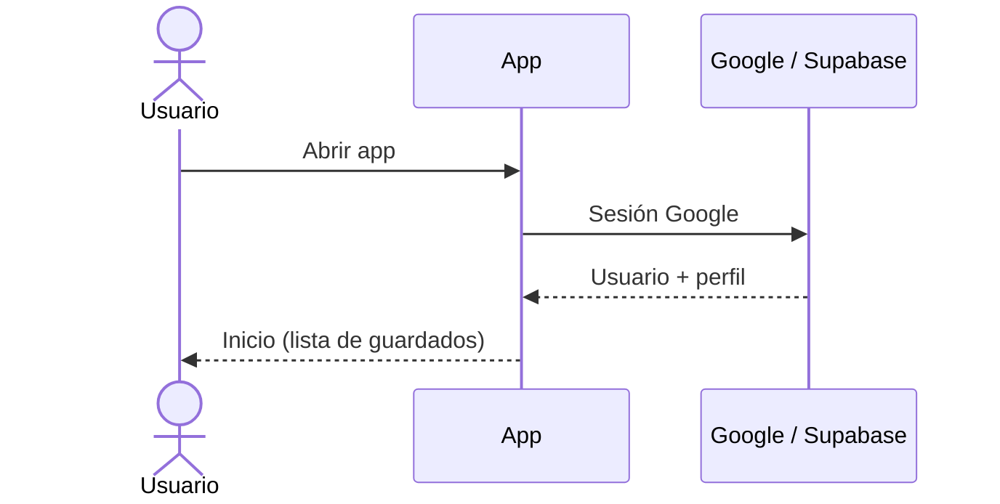
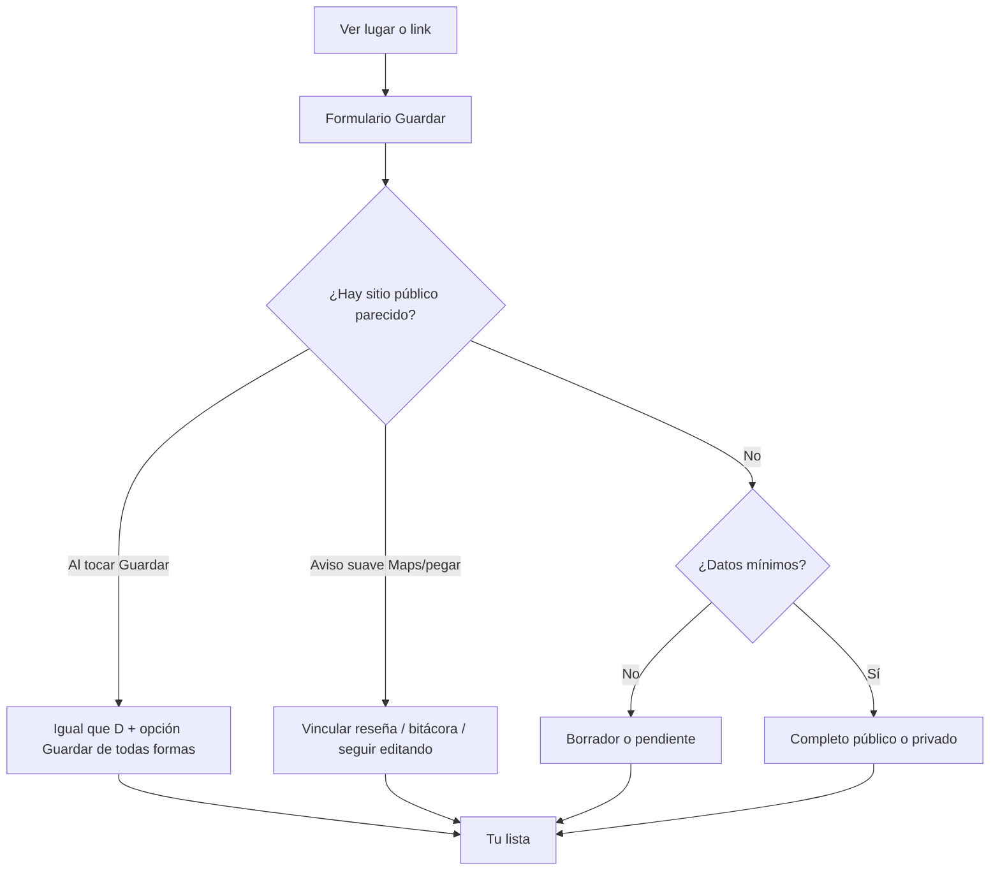
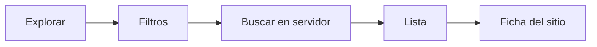
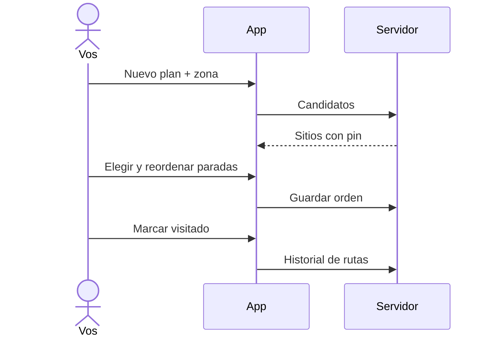
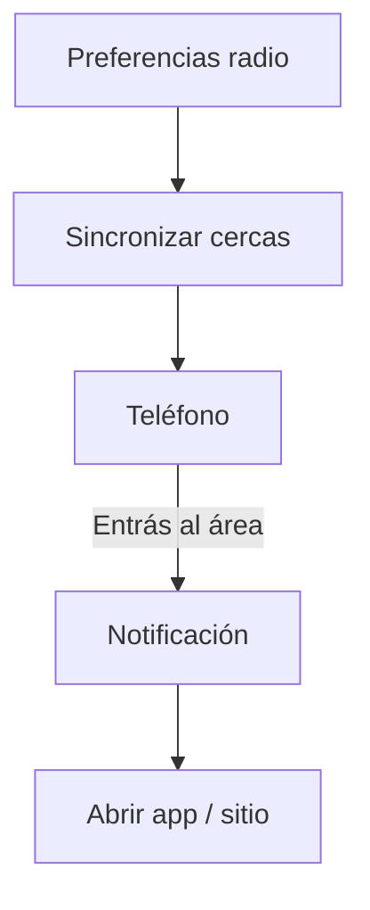
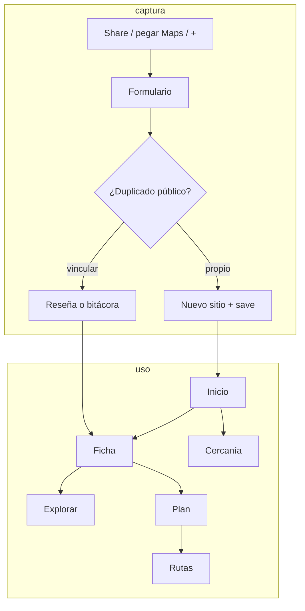

# Chevere Plan — lo que hace la app hoy

Documento de producto **según el código**. Solo lo que un usuario o admin puede hacer **ya**. Se actualiza en el **mismo cambio** que el código.

Qué no romper: [`invariantes.md`](invariantes.md).  
Estilo, pantallas y navegación (para Figma): [`ui-navegacion.md`](ui-navegacion.md).

---

## En una frase

Chevere Plan es una app Android para **guardar lugares** que ves en la vida o en redes, **evitar duplicados públicos**, **escribir reseñas o bitácoras**, **buscar** sitios (tuyos y públicos), **armar un plan de paradas** y **recordarte** cuando estás cerca de uno guardado.

Público y privado se distinguen por **color** (verde / morado), no hace falta repetir las palabras en cada tarjeta.

---

## Quién entra y con qué rol

1. Abrís la app → pantalla de **iniciar sesión con Google**.
2. El servidor crea un perfil (nombre, foto, rol `usuario`).
3. Un correo concreto queda como **root** al resetear la base (dueño del catálogo masivo). Hay también rol **admin**.
4. Admin y root entran al **panel** desde el avatar en Inicio. Reportes viven en ese panel. Sobre **contenido público** actúan casi como dueños. Las **bitácoras privadas no las ven**: solo quien las escribió.

---

## Mapa de la app (barra inferior)

| Sitio | Qué ves |
|---|---|
| **Inicio** | Saludo + título, campana (cercanía), **banner de recuerdo cercano** (abre preferencias de radio), aviso de borradores, **guardados recientes** (carrusel), **populares cerca**, **acciones rápidas**. Tarjetas con portada, corazón de favorito, badge de red si hay origen, verde/morado por visibilidad |
| **Explorar** | Búsqueda de sitios (cabecera Figma, chips de categoría, grilla/lista). Misma lógica: texto obligatorio en modo simple, filtros avanzados, incluir públicos |
| **+ (centro)** | Guardar o completar un lugar (crear y editar son la **misma pantalla**) |
| **Planes** | Tus itinerarios (tarjeta de crear + lista; **un solo** CTA, sin FAB duplicado) |
| **Rutas** | Historial de paradas visitadas (stats del listado + timeline Make). Admin no vive acá |

Los tabs que ya abriste se quedan en memoria para que cambiar de pestaña se sienta instantáneo. Las listas pintan caché primero y refrescan detrás.

**Favoritos:** el corazón (cards de Inicio/Explorar y ficha del sitio) marca o quita el sitio en tu lista de favoritos. Relleno = está marcado. Hoy no hay pestaña ni filtro de favoritos; eso va en [`pendientes.md`](pendientes.md). No es lo mismo que “Tuyo” (tu guardado).

---

## 1. Guardar un lugar

Es el corazón de la app.

### Cómo llega el lugar al formulario

- Botón **+**
- Reabrir un guardado incompleto desde Inicio
- **Compartir** un enlace desde otra app (Maps, Instagram, etc.): se intenta leer nombre, ciudad y coordenadas

Podés pegar un link de Maps **dentro del campo** (opción desde enlace / icono pegar): la app rellena nombre, ciudad y **pin**. Eso cuenta como lugar ya elegido: **no** se pregunta “¿punto exacto?” ni se tiran las coordenadas. **Público** queda habilitado si hay pin. El mapa interactivo tampoco pregunta: el usuario ya confirmó el punto. El interruptor **Punto exacto en el mapa** es opt-out explícito (apagarlo quita coords y bloquea Público en lugar físico). Contrato: [`invariantes.md`](invariantes.md).

### Qué ves en el formulario

Siempre visibles (crear vacío):

1. **Ubicación** — mapa interactivo o enlace Google, más interruptor de punto exacto
2. **Nombre** — obligatorio; el autocompletado de Maps lo rellena igual
3. **Público** — apagado por defecto; sin pin (lugar físico) el interruptor se ve pero no se puede encender

El resto va detrás de **Añadir sección** (`+`): **Detalles** (depto → ciudad → dirección), **Enlaces**, **Categorías**, **Fotos**, **Visibilidad del lugar físico**. Si ya están todas, el `+` desaparece.

- Al **crear**, se asume lugar físico y privado. El interruptor de “es lugar físico” solo aparece si abrís esa sección extra o si **editás**.
- Al **editar** o completar un borrador: se muestran **todas** las secciones.
- Al **compartir** desde otra app: además de ubicación y nombre, se abre **Enlaces**.
- Ayuda: icono **i** (tooltip al toque), no párrafos bajo cada campo.
- Categorías: árbol de la base; al **crear**, default **Otros**; al **editar** no se pisa lo que ya tenía.
- Sin nombre no se puede guardar (el botón queda desactivado). Sin ubicación el guardado puede quedar en borrador.

### Estados del guardado

- **Borrador**: faltan cosas (p. ej. lugar físico sin pin y sin categoría clara)
- **Pendiente de ubicación**: hay categoría explícita pero aún no hay coordenadas
- **Completo**: categoría + (si es físico) coordenadas

Los borradores viejos avisan en Inicio (“completalo”). Hay recordatorios locales espaciados (24 h / 3 días / 7 días) hasta que completes o descartes.

---

## 2. Anti-duplicados (capa pública)

La app no quiere dos fichas públicas del mismo parque a 80 metros.

- Busca por **nombre parecido** + **ciudad** y/o **radio** alrededor del pin (radio amplio para catálogo).
- **Aviso suave** al pegar Maps o elegir pin: podés vincularte al existente o seguir editando. **No** aparece “guardar de todas formas”.
- **Al Guardar**: además podés **crear el tuyo público igual** (“de todas formas”).
- Vincular:
  - **Reseña visible** en el sitio público (o)
  - **Bitácora privada** (solo vos)
- El sitio de catálogo masivo (`external_id`) **no se vuelve privado**.

Staff/admin **no** ve bitácoras ajenas privadas.

---

## 3. Ficha del sitio

Tres pestañas: **info**, **reseñas**, **más** (quién lo creó, catálogo, fechas, “también lo guardaron”).

En info: nombre, visibilidad por color/icono, ciudad, pin, abrir/cómo llegar en Google Maps, categorías, precio, notas, fotos embebidas (menú ⋮ por foto: no un sheet vacío), enlaces. En la barra, corazón de **favorito** (igual que en las cards).

Editar: creador, quien lo tiene en su lista como propio, o staff sobre **público**.

Pasar de público a privado se bloquea si otros lo usan (otros guardados, aportes, paradas de plan) o si es catálogo.

---

## 4. Reseñas y bitácoras

En un sitio **público**:

- **Reseña pública**: texto, estrellas, hasta 3 fotos. Varias por persona a lo largo del tiempo. El promedio usa solo las públicas.
- **Bitácora privada**: mismo formulario, solo el autor la lee. Admin **no**.

Reportar foto inadecuada: el primer reporte avisa a staff (lista de reportes abiertos). Staff puede quitar la foto; borrar el archivo en Storage al cerrar el reporte aún es deuda.

---

## 5. Explorar (búsqueda)

Filtros: texto, categoría, lugar (texto), radio desde GPS, grupo de transporte, rango de presupuesto, incluir o no **públicos de otros**.

Resultados: tuyos, públicos, de catálogo, o **vinculados** (tu save apunta a un público existente). Se ordenan por relevancia/recencia.

El filtro de “horario” en la UI **no recorta** resultados reales todavía (los sitios no tienen horarios de apertura cargados).

---

## 6. Planes

1. Crear plan: título, zona (texto), si incluye públicos, tope de presupuesto.
2. El servidor propone **candidatos** de tus guardados (y públicos si marcaste).
3. Armás paradas. En la lista “añadidos” y en el detalle, con **2+ paradas**, arrastrás el orden; se guarda.
4. Detalle (look Figma): portada, stats de paradas/presupuesto/zona, itinerario, **Llevar a Maps** y compartir abajo. Seguir: abrir ficha, marcar visitado (pasa a **Rutas**), reordenar. El `+` agrega sitios. No hay transporte inventado en stats.
5. Transporte “sugerido por distancia” está **parametrizado en admin** (tipos y km), pero **la app no calcula aún** el medio en la línea de tiempo (código de sugerencia no está cableado).

---

## 7. Rutas

Lista de paradas que marcaste hechas (sitio, plan, fecha). Sirve como “ya pasé por aquí”, no es un GPS grabando el trayecto.

---

## 8. Cercanía (“recuerdos”)

En Inicio, el banner **Recuerdo cercano** (y la campana) abre una hoja corta: radio (100–2000 m) y si querés que cuenten **sitios públicos** además de los tuyos.

El teléfono registra geocercas (tope práctico ~100, priorizando los tuyos). Si entrás al radio, notificación tipo recuerdo. Pedir ubicación “siempre” y el gasto de batería aún se pueden pulir.

---

## 9. Admin y moderación

Solo staff.

- **Categorías**: árbol, keywords para autocomplete, activar/desactivar, +18.
- **Tipos de transporte**: grupo (particular / público / otro), km máximos por defecto, icono.
- **Reportes abiertos**: fotos (y tipos previstos sitio/perfil/evento; la UI cubre sobre todo fotos).

No hay panel de “tarifas de bus por ciudad” ni generación de plan por IA.

---

## 10. Catálogo de Colombia

Departamentos y ciudades vienen de **DIVIPOLA** (DANE), no de listas en la app. Al guardar, Maps puede sugerir texto; la app **casa** eso con el catálogo y guarda **ids**.

El reset completo vuelve a cargar un **JSON masivo** de sitios públicos de Colombia (dueño = cuenta root). Esos sitios alimentan búsqueda, anti-dupe y planes si incluís públicos.

---

## 11. Privacidad (reglas reales)

| Cosa | Quién la ve |
|---|---|
| Sitio privado | Autor (y staff no entra a bitácoras privadas) |
| Sitio público | Cualquier usuario logueado; staff puede editar |
| Guardado / notas / link original | Solo el dueño del save |
| Reseña pública | Quien puede ver el sitio público |
| Bitácora privada | Solo el autor |
| Catálogo masivo | Público; no se privatiza |

Errores en pantalla: mensaje de negocio o *«Error en la app. Intenta de nuevo.»* Nunca SQL ni claves.

---

## 12. Qué **no** hace hoy (aunque el spec viejo lo mencione)

- Compartir plan con un link
- Validar horarios de apertura al armar el plan
- Sugerir bus/bici/carro en cada tramo
- Exportar el plan a Google Maps desde el menú
- IA que “arme un plan para mañana”
- Monetización, eventos, fichas de negocio de pago
- iOS como producto (el código es Flutter; el uso diario es Android)
- Menores de 18 filtrados de forma estricta en toda la app (hay categorías +18 en datos; no hay flujo de edad completo)

Esos huecos viven en [`pendientes.md`](pendientes.md).

---

## Flujos de extremo a extremo (resumen)

---

## Datos que la app trata como “la verdad”

- Categorías y transporte: **base de datos** + caché larga
- Geografía: **DIVIPOLA** + caché 30/90 días
- Sitios, saves, planes, reseñas: servidor; la app muestra caché y confirma después
- Fotos: Storage privado; se pueden ver si el sitio es público o es tuyo
