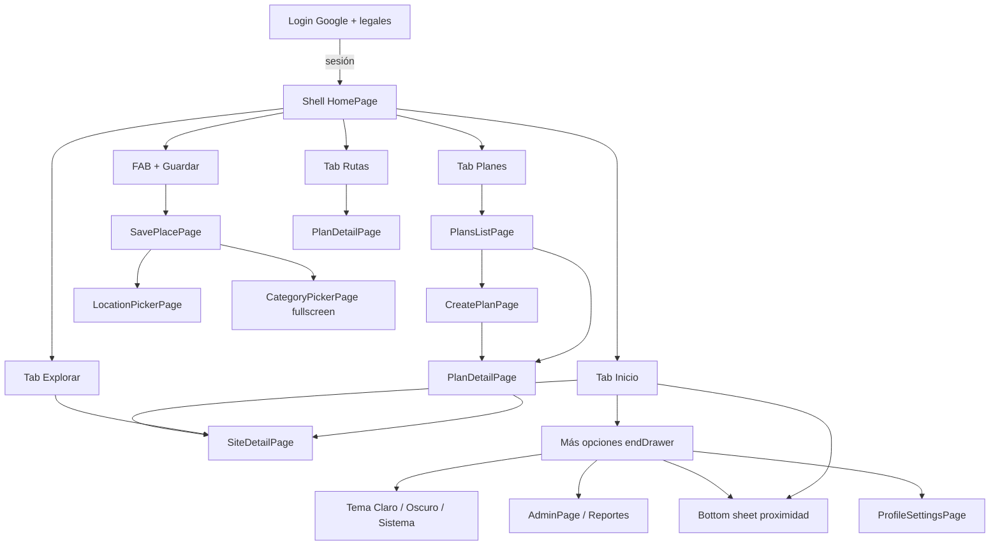

# Chevere Plan — UI, estilo y navegación (estado actual)

Documento **técnico de interfaz**, según el código Flutter de hoy. Sirve para **Figma Make** (o un diseñador) que quiera **mejorar el look** sin inventar funciones.

Comportamiento de producto: [`aplicacion-actual.md`](aplicacion-actual.md).  
Contratos que no se pueden romper: [`invariantes.md`](invariantes.md).

**Marca en código:** Chevere Plan (`com.chevere.plan`). El prototipo Make a veces dice “Chebre Plan”; al diseñar, usar **Chevere Plan**.

**Referencia visual:** Figma Make [Guardados app diseño](https://www.figma.com/make/HhANLxoeQuTr5YJZnTAfG7/Guardados-app-dise%C3%B1o) (`fileKey` `HhANLxoeQuTr5YJZnTAfG7`). Snapshot en el repo: [`design/figma-make/`](../design/figma-make/README.md). Lo de abajo es **lo implementado en Flutter**, no el Make al 100 %.

---

## 1. Cómo usar este archivo en Figma

1. Tratar cada pantalla de la §6 como un **frame Android** (390×844 lógico, o el viewport del Motorola del dueño).
2. Respetar **tokens** (§3) y **señales** (§4). Hay tema **oscuro y claro**; diseñar ambos si se entrega a Figma. No iOS-only.
3. Mejorar jerarquía, ritmo, fotos, iconografía y microcopy **sin** inventar funciones. Favoritos = **corazón** + filtro **Mis favoritos** en Explorar + atajo desde Inicio (no hay pantalla “Mis favoritos” dedicada). No hay IA, ni share de ficha de sitio, ni admin en Rutas.
4. **Guardar lugar:** el CTA **Guardar** va **abajo**, ancho, al alcance del pulgar. El Make a veces lo pone en el AppBar: **no replicar eso**.
5. Las fotos de sitios: encabezado = **portada** (`SiteLookCover`: categoría padre + `cover_photo_id`), igual en listas, tarjetas y ficha. Visor a pantalla completa con autor, fecha y ⋮ (portada / eliminar / reportar). La tira de info no lleva ⋮. Sin foto, ilustración del **padre**. El mismo sitio se ve igual en Inicio, Explorar, Planes y Rutas.
6. Entregar frames nombrados como las pantallas de la §6 para mapear 1:1 a widgets Flutter.
7. **Compartir:** hoy — entrante SO → Guardar; plan = clipboard; ficha sin share. **Fase 2** (diseño): [`pendientes.md`](pendientes.md). No inventar UI de share en Figma del MVP.

---

## 2. Plataforma y shell

| Dato | Hoy |
|---|---|
| Plataforma | Android (Flutter, Material 3) |
| Tema | **Oscuro** (default), **claro** o **sistema**; selector segmentado en menú ☰ (Claro · Oscuro · Sistema). Persiste en el dispositivo. |
| Idioma UI | Español (strings en `.arb`; no hardcodear copy en Figma si se puede evitar) |
| Navegación raíz | `MaterialApp` + `Navigator` implícito. Sin GoRouter. |
| Sesión | Sin login → `LoginPage`. Con sesión → `HomePage` (shell de 4 tabs + FAB). |
| Share del SO (entrante) | Intent / share sheet → `SavePlacePage` encima del shell (parseo Maps/redes). |
| Share saliente sitio | **No existe** en UI. |
| Share saliente plan | Icono share → **Clipboard** (título + bullets de nombres); toast “copiado”. |
| Tabs | `IndexedStack`: Explorar / Planes / Rutas se **crean al primer toque** y **no se destruyen**. |
| Atrás (Android) | En tabs distintos de Inicio → vuelve a Inicio. En Inicio → toast y segundo atrás cierra (`SystemNavigator.pop`). Rutas apiladas (ficha, guardar) hacen pop normal. |
| Body | `extendBody: true` — el contenido pasa **detrás** de la barra; paddings inferiores ~72–120 px en listas. |



**Push vs sheet (regla actual):** galerías de la ficha van **incrustadas** (tira horizontal). El visor a pantalla completa y las listas altas van en **página** (`Navigator.push` + `Scaffold`). Sheets solo cortos (proximidad, menú ⋮ del plan). Sheet mal montado = oscurece y no se ve contenido: hay que evitarlo.

---

## 3. Tokens de diseño (código)

Fuente: `frontend/lib/core/theme/` (`ChevereThemeColors`, `AppColors`, `AppSpacing`, `AppTheme`). Los tokens viven en `ChevereThemeColors` (extensión de tema); `AppColors` refleja la paleta activa.

### 3.1 Color

Cada token tiene valor **oscuro** y **claro**. Marca: azul `primary` + teal `primarySoft` (gradiente CTA/FAB). `onPrimary`: texto/ícono sobre CTA (oscuro `#0B0D15`, claro `#FFFFFF`).

| Token | Oscuro | Claro | Uso |
|---|---|---|---|
| `background` | `#0B0D15` | `#F7F9FC` | Scaffold, AppBar |
| `surface` | `#141A24` | `#FFFFFF` | Cards, campos, sheets |
| `surfaceElevated` | `#1C2333` | `#EEF1F7` | Chips, tracks |
| `sidebar` | `#0E1120` | `#FFFFFF` | Barra inferior |
| `foreground` | `#F0F4FF` | `#12141C` | Texto principal |
| `muted` | `#8E93AC` | `#5C6178` | Secundario |
| `mutedDark` | `#5A607A` | `#9096AC` | Terciario, nav inactiva |
| `primary` | `#3D8BFF` | `#2563EB` | CTA, tab activo, links, FAB |
| `primarySoft` | `#33D6C8` | `#0EA5B7` | Gradiente CTA |
| `accent` | `#FF5252` | `#E0393E` | Error, corazón, stats calientes |
| `success` | `#00D68F` | `#00A876` | **Público** |
| `purple` | `#8B7FFF` | `#6C5CE7` | **Privado** |
| `border` | blanco ~6% | negro ~8% | Bordes card/input |
| `outlineVariant` | blanco ~8% | negro ~10% | Borde Material |
| `scrim` | negro ~54% | negro ~40% | Overlays |
| `coverScrim` | negro ~40% | negro ~30% | Degradado sobre portada |
| `onImage` / `onImageMuted` | blanco / 54% | igual | Texto sobre foto |
| `requiredMark` | `#FF8C00` | `#D9720A` | Asterisco obligatorio |

**Categorías (chip / ilustración):** gastro, aloj, nat, cult, **ent** (`#F2789F` / `#D65A82`), comp, even, serv, deporte — ver `ChevereThemeColors` en código. Portadas sin foto: aloj `#6B74D6`/`#565EBF`, nat `#1B8F6A`/`#177956`, deporte `#3D9B6E`/`#32805C`.

**Gradiente CTA / FAB:** `primary` → `primarySoft` (esquina sup-izq a inf-der). Sombra FAB: primary 45%, blur 22, offset (0, 4).

**Login Google:** oscuro fondo `#1A1A1A`; claro fondo `#FFFFFF` con borde negro ~12%.

### 3.2 Tipo

| Rol | Familia | Peso típico | Tamaño típico |
|---|---|---|---|
| Títulos de tab / AppBar / hero | **Plus Jakarta Sans** | ExtraBold 800 | Tab 22 · AppBar 18 · hero plan 20 |
| Sección (home) | Plus Jakarta Sans | ExtraBold 800 | 13 |
| Cuerpo, botones, campos | **DM Sans** (textTheme) | Regular / Bold 700 en filled | Botón 14 |
| Meta en cards | DM Sans | 9–12 | muted / mutedDark |
| Badge red social | Sans, ExtraBold | 9 | Texto 2 letras sobre color de red |

Todo el texto de producto está en `app_es.arb` (i18n).

### 3.3 Espacio y radio

| Token | px |
|---|---|
| `xs` | 4 |
| `sm` | 8 |
| `md` | 12 |
| `lg` | 16 |
| `xl` | 24 |
| `xxl` | 32 |

| Elemento | Radio |
|---|---|
| Card genérica / diálogo | 16 |
| Input, filled button | 12 |
| Chip categoría | 20 (stadium) |
| FAB guardar | círculo 56 |
| Icono redondo (`AppRoundIconButton`) | círculo, padding 10 |
| Badge red social | 4 |
| Corazón sobre foto | círculo, padding 6 |

**Alturas fijas usadas hoy**

| Pieza | px |
|---|---|
| Barra inferior (contenido, sin safe area) | 64 |
| FAB central | 56 |
| Carrusel recientes (fila) | 176 |
| Card reciente | ancho 144 |
| Portada grid sitio | **flex** ≈55% de la celda (`SiteCardGridMetrics.coverFlex` 11); no altura fija única |
| Bloque textos grid | **flex** ≈45% (`textFlex` 9); scroll interno si desborda |
| Fila lista sitio | alto **104** (`SiteCardListMetrics.rowHeight`); miniatura ≈98%; origen **24**; corazón icono **24×24** |
| Portada card de plan (lista) | alto **96** |
| Hero detalle de plan / ficha | alto **176** |
| Botón filled | min height 48 |
| Grid sitios (2 cols) | `childAspectRatio` vía layout (~**0.75** en anti-dupe 2 col); gap 10–12; Inicio/Explorar usan ratio por ancho |

---

## 4. Señales visuales (no negociables en rediseño)

1. **Verde = público, morado = privado.** Si la card ya tiene borde/franja de ese color, **no** poner la palabra Público/Privado.
2. Sin borde: **solo icono** (`public` / `lock`) del mismo color + tooltip. Nunca icono + label del mismo concepto.
3. Etiquetas de **origen** (distintas del color): **Tuyo**, **Tarjeta** (no físico), **Catálogo**, **Público** (solo si es público y no tuyo ni catálogo), **Vinculado**. También: Borrador, Próximo.
4. Listas clicables: chevron `>` y fecha si aporta.
5. **Corazón** en cards y ficha: **favorito** persistido. Relleno rojo `accent` si está marcado; outline si no. El tap no abre la ficha. “Tuyo” ≠ favorito.
6. **Badge de red** (IG / TK / FB / GM): solo si hay `sourceNetwork`. Si no hay origen de red, **nada**.
7. Acciones de campo: icono **dentro** del input (lupa, pegar), no botones sueltos al lado del formulario.
8. **Confirmaciones** (`AppConfirmDialog`): mismo estilo en toda la app. Icono de la acción antes del título; copy corto. Dos botones en una fila (el que prima a la derecha); tres o más en una columna (el que prima al final).
9. Errores de sección: callout **Error en la app.** + **Intenta de nuevo**. Fallo con CTA Guardar: toast «Se ha presentado un problema.» — sin callout encima del botón.

---

## 5. Componentes (widgets) reutilizables

| Widget | Archivo | Qué es |
|---|---|---|
| `TabScreenHeader` | `tab_screen_header.dart` | Título 22 ExtraBold + subtítulo 12 muted. Sin AppBar. |
| `AppRoundIconButton` | mismo | Círculo surface; selected = primary 18% + icono primary. |
| `SiteLookCover` / `SiteCover` | `site_cover.dart` | Portada = foto de encabezado o ilustración del **padre**; decode acotado al tamaño de celda. |
| `CardHeartBadge` | mismo | Corazón sobre foto (relleno = favorito). |
| `FavoriteHeartButton` | `favorite_heart_button.dart` | Tap para marcar/quitar favorito (24×24 en cards densas). |
| `SiteCardOriginRow` / `SiteOriginTags` | `site_origin_tags.dart` | Fila origen + `VisibilityBadge`. |
| `SiteCardScrollablePlaceTexts` | `home_cards.dart` | Nombre / depto-ciudad / dirección; scroll interno si no cabe. |
| `HomeSourceBadge` | `home_cards.dart` | Pastilla 2 letras, color de red. |
| `HomeCategoryChip` | mismo | Chip 9 px, tinte por nombre de categoría. |
| `HomeSectionHeader` | mismo | Título de sección + “ver todo” primary. |
| `HomeRecentRailCard` | mismo | Carrusel: cover 144×176, badge red, borrador, corazón, franja/icono, nombre/ciudad, chip categoría. |
| `HomePopularCard` | mismo | Grid: franja+borde, `SiteLookCover` ≈55%, origen, textos scroll, km/precio. |
| `HomeSearchListCard` | mismo | Lista Explorar: fila 104, miniatura, mismos textos/origen/corazón. |
| `HomeQuickAction` | mismo | Icono circular tintado + label 10 px debajo. |
| `HomeQuickActionsRow` / `HomeQuickActionsDock` | mismo | Fila de 4 atajos; dock flotante con desfijar. |
| `AppConfirmDialog` / `showAppConfirmDialog` | `app_confirm_dialog.dart` | Confirmaciones: icono + título + texto breve. **2** acciones en fila (primaria a la derecha); **3+** en columna (primaria al final). |
| `VisibilityBadge` | `visibility_badge.dart` | Icono público/privado. |
| `AppListCard` | `app_list_card.dart` | `Card` theme, margin bottom 8. |
| `AppAsyncBody` | `app_async_body.dart` | Pull-to-refresh: loading / `AppRetryCallout` / vacío / lista. |
| `AppRetryCallout` | `app_retry_callout.dart` | “Error en la app.” + botón subrayado “Intenta de nuevo”. |
| `FieldActionIcon` | `field_action_icon.dart` | Suffix: buscar/pegar con loading. |
| `AppNetworkImage` | `app_network_image.dart` | `cached_network_image` + decode acotado. |
| `AppToast` | `app_toast.dart` | Snackbar; error de negocio o “Error en la app…”. |
| `AppBusyOverlay` | `app_busy_overlay.dart` | Bloqueo breve (p. ej. abrir Maps). |
| `AppMoreMenuDrawer` | `app_more_menu_drawer.dart` | `endDrawer` derecha: cuenta, **tema** (segmentado Claro/Oscuro/Sistema), recuerdos, admin, cerrar sesión. |
| `AppMenuAvatarButton` | `app_menu_avatar_button.dart` | Foto/inicial en cabeceras del shell → abre el menú. |
| `AppSegmentedControl` | `app_segmented_control.dart` | Selección única en grupo redondeado (tema, etc.). |

**Iconografía:** Material Icons. Redes en cards son **texto** (IG/TK/FB/GM), no SVG de marca.

---

## 6. Inventario de pantallas

### 6.1 Login — `LoginPage`

- Fondo `background`, padding horizontal 24, contenido centrado.
- Logo 72×72, radio 20, **gradiente primary**, pin de mapa.
- Título app (Jakarta ExtraBold 28) + claim.
- Checkbox custom (cuadrado 20, check al aceptar) + texto con links a `LegalDocumentPage` (términos y privacidad).
- Botón Google según tema: oscuro fondo `#1A1A1A` texto claro; claro fondo blanco con borde y texto oscuro. Apagado si no aceptaste legales. Sigue siendo **solo Google**.

### 6.2 Shell — `HomePage`

Barra inferior `sidebar`, borde top `border`:

| Slot | Icono | Label arb |
|---|---|---|
| 0 | `home_rounded` | Inicio |
| 1 | `explore_outlined` | Explorar |
| Centro | `add` 28 en círculo gradiente | Guardar (no es tab) |
| 2 | `map_outlined` | Planes |
| 3 | `route_outlined` | Rutas |

Tab activo: icono + label `primary`. Inactivo: `mutedDark`, label 10 px.

**Inicio (`_InicioTab`)** — sin AppBar:

1. Saludo 11 mutedDark + título app 22 ExtraBold. **Foto de perfil** (derecha; si no hay, inicial) abre `endDrawer` Más opciones. La misma foto va en cabeceras de Explorar / Planes / Rutas (`AppMenuAvatarButton`). Menú: **Tu perfil**, **Tarjetas**, Recuerdos cercanos, Mismo sitio al guardar (m), Unidad de distancia, **Tema** (Claro · Oscuro · Sistema), Admin/Reportes si staff, versión, **Cerrar sesión**. Con **navegación por gestos** del sistema no se abre el drawer arrastrando el borde (choca con “atrás”); se abre con la foto. Con 3 botones, el arrastre lateral sí puede abrir.
2. **Vista** (lista / 2 / 3 / 4); aplica a recientes y populares (misma preferencia que Explorar).
3. Aviso de **borradores** (card naranja), si hay.
4. **Eventos**: título plegable; contenido *Próximamente.* (placeholder).
5. **Guardados recientes**: solo **lugares físicos** (hasta 5). El título pliega. **Ver más** abre Explorar.
6. **Populares cerca**: mismos plegado y vista. **Ver más** abre Explorar. Vacío / sin GPS: texto muted.
7. **Acciones rápidas** (al final): título plegable (abierta por defecto la 1.ª vez); atajos **Cerca de mí / Mis guardados / Mis favoritos / Por categoría** (+ fijar). Si se fija, sale del scroll y queda **pegada encima** del menú inferior (mismo color `sidebar`, sin hueco; pin para desfijar). Solo en pestaña Inicio. Persistido en el teléfono. Cada atajo resetea filtros de Explorar y dispara búsqueda.
8. Padding bottom grande por `extendBody` (más si la barra está fijada).

### 6.3 Explorar — `SearchPage`

- `TabScreenHeader` “Explorar” + avatar menú.
- Fila: `AppSearchField` (lupa / clear **dentro**) + reset filtros (`filter_alt_off`) + tune (avanzado).
- **Query opcional:** lupa/Enter buscan; vacío + filtros (categoría, GPS, mis guardados, favoritos) también buscan. No hay modo “query obligatorio”.
- Avanzado (panel surface): ubicación extra; **usar mi ubicación** + radio en **unidad preferida** del usuario; toggles **Mis guardados** y **Mis favoritos**. Transporte y presupuesto: **ocultos** (no funcionales). Sin campo de horario en UI.
- Checkbox **Varias categorías** + chips horizontales (Todos + raíces DB). **Sí disparan búsqueda** al tocar.
- Tras buscar: fila **fija** bajo chips — `{n} resultados` + `AppFeedLayoutToggle` (lista / 2 / 3 / 4). **No** va dentro del scroll de resultados.
- Resultados: grilla `HomePopularCard` / lista `HomeSearchListCard` (origen, corazón, portada 55%, textos con scroll interno).
- **Paginación servidor:** página de **15**; botón **Cargar más** concatena; se oculta si la página trae &lt; 15.
- Errores: `AppRetryCallout`. Mis guardados / favoritos: red fresca (sin SWR stale).

### 6.4 Guardar / editar — `SavePlacePage` (misma pantalla)

- AppBar solo con título (atrás del sistema). **Guardar** / **Guardar cambios** = `FilledButton` **fijo abajo**, ancho, un solo CTA. Amarillo si hay matches anti-dupe al guardar.
- **Crear físico vacío:** sección **Ubicación** visible (Mapa / Enlace / Cámara + switch **Punto exacto** apagado por defecto). Nombre+visibilidad detrás de chips **Añadir sección** (se abren solos si Maps trae nombre).
- **Crear no físico:** sin mapa; `NonPhysicalCardBanner`; Nombre+visibilidad.
- **Share social (no Maps):** Nombre + Enlaces abiertos de inmediato.
- **Editar / borrador:** secciones abiertas; ubicación solo si sigue físico; **sin** pestaña pegar enlace Maps.
- Público: icono verde/morado + switch; deshabilitado sin pin (físico) o si no es físico. Ayuda con `i`, no párrafos.
- Chips extras: Nombre-Visibilidad, Detalles, Enlaces, Categorías, Fotos.
- Categorías: `CategoryPickerPage` fullscreen. Mapa: `LocationPickerPage`. Coincidencia: `SameSitePickerPage` (grilla cards estándar + Ver ficha / Usar como / Seguir).
- Dirty: salir → `AppConfirmDialog` ¿Descartar cambios?
- Tras guardar: pop (no pantalla “¡Guardado!”).

### 6.5 Ficha de sitio — `SiteDetailPage`

- Header in-body: back circular, título, corazón favorito, ⋮ (editar/descartar). **Sin** icono compartir.
- Hero 176: `SiteLookCover` + scrim + franja verde/morada + origen + precio.
- `TabBar`: Info, Reseñas, Más (creador, catálogo, fechas, “también lo guardaron”).
- Info: datos, galería **incrustada** (tira; tocar → visor fullscreen con autor, fecha `dd/mmm/aaaa`, ⋮ portada/eliminar/reportar). Maps (abrir / cómo llegar).
- Reseñas públicas / bitácoras privadas (no scores inventados).
- **No** hay FAB “Agregar a un plan” ni share de ficha.

### 6.6 Planes — lista `PlansListPage`

- `TabScreenHeader` “Planes” (sin subtítulo).
- FAB extendido abajo derecha sobre la nav del shell (`AppAnchoredFloatingAction` + `AppFloatingActionLayout`; gap estándar **12** px).
- Card de plan: portada 96 px del **primer sitio** (`SiteLookCover`) + `AppStatusPill` + título overlay + fila meta (zona, N sitios, presupuesto).
- Vacío: mensaje; FAB sigue visible.

### 6.7 Crear / editar plan — `CreatePlanPage`

Formulario: **título** * (mín. 3 caracteres; Enter guarda), zona (Siguiente → presupuesto), presupuesto (Enter guarda). Campos con ayuda y **X** para borrar. **Sin** incluir públicos (buscador del detalle). Al crear → `PlanDetailPage` (Buscar). Al editar meta → Guardar y volver.

**Eliminar plan:** borra en cascada paradas, reseñas, fotos de reseña (DB + Storage vía trigger).

### 6.8 Detalle de plan — `PlanDetailPage` (buscar + agregados)

- **Sin AppBar.** Hero 176: portada primer sitio + scrim + back + ⋮ + título + zona.
- 3 stats: Paradas, Presupuesto, Zona.
- Hero: título + meta **zona — $ presupuesto** (`onImage` + icono `warning`).
- Cuadros: **Buscar** | **Paradas** | **Reseñas** (conteo). Tocar Reseñas → bitácora del plan (sin estrellas; orden por fecha).
- Pie: **Llevar a Maps** + **Listo** (Buscar) / **Guardar** (Paradas si cambió), mismo ancho.
- ⋮: editar meta, eliminar (sin Maps duplicado).

### 6.10 Rutas — `MyRoutesPage`

- `TabScreenHeader` “Mis rutas” + subtítulo.
- 3 `AppStatCard` (visitados / ciudades / planes) calculados **en cliente** del historial. Colores: primary / success / purple.
- `AppSectionLabel` “Historial”.
- Timeline: nodo check verde + `SiteCover` 40×40 + nombre y ciudad/fecha. Tap → detalle del plan.
- Solo aparecen paradas **ya visitadas** (no se inventan pendientes).
- **No** hay escudo admin aquí.

### 6.11 Admin / reportes / legales / mapa

- `AdminPage`: 3 `AppStatCard` **reales** (nº categorías, vehículos, reportes abiertos). Tabs categorías / vehículos. **No** hay cifras inventadas de usuarios.
- `AdminReportsPage`: lista de reportes abiertos reales.
- `LegalDocumentPage`: texto.
- `LocationPickerPage`: mapa + buscar. **Sin pin inicial** → foco automático en el buscador (+ X para limpiar). Con pin → no roba el foco.

### 6.12 Sheets cortos

| Sheet | Contenido |
|---|---|
| Proximidad | Radio 100–2000 m, incluir públicos, guardar |
| Más del plan | 3 list tiles |

---

## 7. Navegación: qué empuja qué

| Desde | Acción | Hacia |
|---|---|---|
| Login | Google OK | Shell |
| Shell FAB / Inicio borrador | | `SavePlacePage` (crear o editar) |
| `SavePlacePage` | coincidencia | `SameSitePickerPage` |
| `SameSitePickerPage` | fila / chevron | `SiteDetailPage` (atrás vuelve a la lista) |
| Share OS | | `SavePlacePage` |
| Card sitio (inicio, explorar, plan) | | `SiteDetailPage` |
| Inicio ☰ | | `endDrawer` Más opciones |
| Más opciones → Recuerdos | | Sheet proximidad |
| Más opciones → Admin (staff) | | `AdminPage` |
| Más opciones → Reportes (staff) | | `AdminReportsPage` |
| Más opciones → Perfil | | `ProfileSettingsPage` |
| Banner recuerdo | | *(eliminado; recuerdos en menú ☰)* |
| Planes CTA crear | | `CreatePlanPage` → `PlanDetailPage` (Buscar) |
| Card plan / item ruta | | `PlanDetailPage` |
| Marcar visitado en plan | | Ese stop aparece en Rutas (dato, no push) |
| Plan icono share / menú Compartir | | Clipboard local (texto); toast |
| Ficha sitio | | **Sin** destino share |

No hay navegación por URL. Back del sistema / AppBar / chevron hero.

---

## 8. Estados de UI a diseñar

- Loading primera vez: `CircularProgressIndicator` primary (centrado o en lista async).
- Error de sección (sin CTA propio): `AppRetryCallout` — “Error en la app.” + “Intenta de nuevo”. Nunca SQL/PostgREST.
- Fallo al Guardar (hay CTA): toast «Se ha presentado un problema.» — sin callout encima del botón.
- Vacío: texto muted; en Planes el CTA de crear sigue.
- Offline: caché SWR (se ve dato viejo); no hay ilustración offline dedicada.
- Disabled: Público apagado sin pin / no físico; Google login sin legales; guardar sin nombre.

---

## 9. Deuda visual (prioridad para Figma)

Orden sugerido para que un rediseño aporte:

1. **Fotos reales** en listas (composición: ratio, overlay, fallback). Hoy el fallback es ilustración genérica.
2. Unificar **AppBar vs header in-body** (Inicio/Explorar/Planes/Rutas vs Guardar/Admin).
3. El corazón **sí** es favorito (tap funcional). No rediseñarlo como “es tuyo”.
4. **No diseñar aún como si existiera:** pantalla dedicada “Mis favoritos”, share OS / deep link de **ficha de sitio**, share de **plan por link**, onboarding extra, IA que arme planes, tab Admin, cálculo de transporte en el itinerario, filtro horario real.
5. Al rediseñar share: hoy plan = clipboard; sitio = ausente — no inventar botones que impliquen producto no decidido.

---

## 10. Archivos Flutter ancla

```
frontend/lib/core/theme/app_theme.dart
frontend/lib/core/widgets/tab_screen_header.dart
frontend/lib/core/widgets/site_cover.dart
frontend/lib/features/home/presentation/home_page.dart      # shell + inicio + nav
frontend/lib/features/home/presentation/home_cards.dart
frontend/lib/features/search/presentation/search_page.dart
frontend/lib/features/saves/presentation/save_place_page.dart
frontend/lib/features/saves/presentation/site_detail_page.dart
frontend/lib/features/saves/presentation/category_picker_sheet.dart
frontend/lib/features/plans/presentation/plans_list_page.dart
frontend/lib/features/plans/presentation/create_plan_page.dart
frontend/lib/features/plans/presentation/plan_detail_page.dart
frontend/lib/features/routes/presentation/my_routes_page.dart
frontend/lib/l10n/app_es.arb
```
