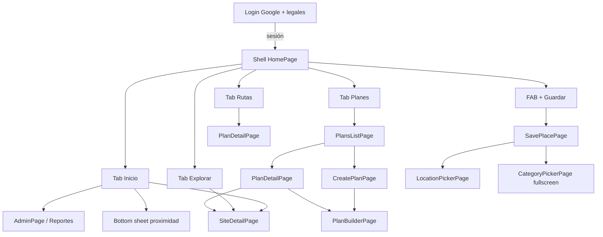

# Chevere Plan — UI, estilo y navegación (estado actual)

Documento **técnico de interfaz**, según el código Flutter de hoy. Sirve para **Figma Make** (o un diseñador) que quiera **mejorar el look** sin inventar funciones.

Comportamiento de producto: [`aplicacion-actual.md`](aplicacion-actual.md).  
Contratos que no se pueden romper: [`invariantes.md`](invariantes.md).

**Marca en código:** Chevere Plan (`com.chevere.plan`). El prototipo Make a veces dice “Chebre Plan”; al diseñar, usar **Chevere Plan**.

**Referencia visual:** Figma Make [Guardados app diseño](https://www.figma.com/make/HhANLxoeQuTr5YJZnTAfG7/Guardados-app-dise%C3%B1o) (`fileKey` `HhANLxoeQuTr5YJZnTAfG7`). Snapshot en el repo: [`design/figma-make/`](../design/figma-make/README.md). Lo de abajo es **lo implementado en Flutter**, no el Make al 100 %.

---

## 1. Cómo usar este archivo en Figma

1. Tratar cada pantalla de la §6 como un **frame Android** (390×844 lógico, o el viewport del Motorola del dueño).
2. Respetar **tokens** (§3) y **señales** (§4). No introducir tema claro ni iOS-only.
3. Mejorar jerarquía, ritmo, fotos, iconografía y microcopy **sin** agregar flujos (favoritos = solo el corazón; no hay IA, no hay admin en Rutas).
4. **Guardar lugar:** el CTA **Guardar** va **abajo**, ancho, al alcance del pulgar. El Make a veces lo pone en el AppBar: **no replicar eso**.
5. Las fotos de sitios **casi nunca llegan a las listas**: hoy hay **portada ilustrada por defecto**. Un rediseño puede proponer recortes, máscaras y empty-photo más ricos; el producto aún no rellena `imageUrl` en home/búsqueda/planes.
6. Entregar frames nombrados como las pantallas de la §6 para mapear 1:1 a widgets Flutter.

---

## 2. Plataforma y shell

| Dato | Hoy |
|---|---|
| Plataforma | Android (Flutter, Material 3) |
| Tema | **Solo oscuro** |
| Idioma UI | Español (strings en `.arb`; no hardcodear copy en Figma si se puede evitar) |
| Navegación raíz | `MaterialApp` + `Navigator` implícito. Sin GoRouter. |
| Sesión | Sin login → `LoginPage`. Con sesión → `HomePage` (shell de 4 tabs + FAB). |
| Share del SO | Deep-link / share intent abre `SavePlacePage` encima del shell. |
| Tabs | `IndexedStack`: Explorar / Planes / Rutas se **crean al primer toque** y **no se destruyen**. |
| Atrás (Android) | En tabs distintos de Inicio → vuelve a Inicio. En Inicio → toast y segundo atrás cierra (`SystemNavigator.pop`). Rutas apiladas (ficha, guardar) hacen pop normal. |
| Body | `extendBody: true` — el contenido pasa **detrás** de la barra; paddings inferiores ~72–120 px en listas. |



**Push vs sheet (regla actual):** galerías y listas altas van en **página** (`Navigator.push` + `Scaffold`). Sheets solo cortos (proximidad, menú ⋮ del plan). Sheet mal montado = oscurece y no se ve contenido: hay que evitarlo.

---

## 3. Tokens de diseño (código)

Fuente: `frontend/lib/core/theme/app_theme.dart` (`AppColors`, `AppSpacing`, `AppTheme`).

### 3.1 Color

| Token | Hex | Uso |
|---|---|---|
| `background` | `#0B0D15` | Scaffold, AppBar |
| `surface` | `#141A24` | Cards, campos, sheets, tiles |
| `surfaceElevated` | `#1C2333` | Chips, tracks, bloques un peldaño arriba |
| `sidebar` | `#0E1120` | Barra inferior |
| `foreground` | `#F0F4FF` | Texto principal |
| `muted` | `#8E93AC` | Secundario |
| `mutedDark` | `#5A607A` | Terciario, nav inactiva, hints |
| `primary` | `#FFBB33` | CTA, tab activo, acentos de marca |
| `primarySoft` | `#FF8C42` | Extremo del gradiente CTA |
| `accent` | `#FF5252` | Error, corazón “guardado”, acentos calientes |
| `success` | `#00D68F` | **Público** (y stats positivas) |
| `purple` | `#8B7FFF` | **Privado** / candado |
| `border` | blanco ~6% | Bordes de card/input (`#0FFFFFFF`) |
| `scrim` | negro 54% | Overlays |
| `onImage` | `#FFFFFF` | Texto sobre foto |
| `onImageMuted` | blanco 54% | Subtexto sobre foto |
| `requiredMark` | `#FF8C00` | Asterisco de obligatorio |

**Categorías (tinte de chip, no es taxonomía fija en Dart de negocio):** gastro `#FF8C42`, aloj `#8B7FFF`, nat `#00D68F`, cult `#E84393`, ent `#FFBB33`, comp `#00C9A7`, even `#FF5252`, serv `#4A90D9`, deporte `#2ECC71`. El árbol real vive en DB.

**Gradiente CTA / FAB guardar:** `#FFBB33` → `#FF8C42`, esquina superior-izq a inferior-der. Sombra del FAB central: primary a 45% blur 22 offset (0, 4).

### 3.2 Tipo

| Rol | Familia | Peso típico | Tamaño típico |
|---|---|---|---|
| Títulos de tab / AppBar / hero | **Plus Jakarta Sans** | ExtraBold 800 | Tab 22 · AppBar 18 · hero plan 20 |
| Sección (home) | Plus Jakarta Sans | ExtraBold 800 | 13 |
| Cuerpo, botones, campos | **DM Sans** (textTheme) | Regular / Bold 700 en filled | Botón 14 |
| Meta en cards | DM Sans | 9–12 | muted / mutedDark |
| Badge red social | Sans, ExtraBold | 9 | Texto 2 letras sobre color de red |

Todo el texto de producto está en `app_es.arb` (i18n).

### 3.3 Espacio y radio

| Token | px |
|---|---|
| `xs` | 4 |
| `sm` | 8 |
| `md` | 12 |
| `lg` | 16 |
| `xl` | 24 |
| `xxl` | 32 |

| Elemento | Radio |
|---|---|
| Card genérica / diálogo | 16 |
| Input, filled button | 12 |
| Chip categoría | 20 (stadium) |
| FAB guardar | círculo 56 |
| Icono redondo (`AppRoundIconButton`) | círculo, padding 10 |
| Badge red social | 4 |
| Corazón sobre foto | círculo, padding 6 |

**Alturas fijas usadas hoy**

| Pieza | px |
|---|---|
| Barra inferior (contenido, sin safe area) | 64 |
| FAB central | 56 |
| Carrusel recientes (fila) | 176 |
| Card reciente | ancho 144 |
| Portada grid sitio | alto **100** |
| Portada card de plan (lista) | alto **96** |
| Hero detalle de plan | alto **176** |
| Botón filled | min height 48 |
| Grid sitios | 2 columnas, `childAspectRatio` **0.90**, gap 10–12 |

---

## 4. Señales visuales (no negociables en rediseño)

1. **Verde = público, morado = privado.** Si la card ya tiene borde/franja de ese color, **no** poner la palabra Público/Privado.
2. Sin borde: **solo icono** (`public` / `lock`) del mismo color + tooltip. Nunca icono + label del mismo concepto.
3. Etiquetas permitidas aparte del color: Tuyo, Vinculado, Catálogo, Borrador, Próximo.
4. Listas clicables: chevron `>` y fecha si aporta.
5. **Corazón** en cards y ficha: **favorito** persistido. Relleno rojo `accent` si está marcado; outline si no. El tap no abre la ficha. “Tuyo” sigue siendo otra señal.
6. **Badge de red** (IG / TK / FB / GM): solo si hay `sourceNetwork`. Si no hay origen, **nada**.
7. Acciones de campo: icono **dentro** del input (lupa, pegar), no botones sueltos al lado del formulario.

---

## 5. Componentes (widgets) reutilizables

| Widget | Archivo | Qué es |
|---|---|---|
| `TabScreenHeader` | `tab_screen_header.dart` | Título 22 ExtraBold + subtítulo 12 muted. Sin AppBar. |
| `AppRoundIconButton` | mismo | Círculo surface; selected = primary 18% + icono primary. |
| `SiteCover` | `site_cover.dart` | Foto de red o `DefaultSiteCover` (gradiente montaña + icono landscape). |
| `CardHeartBadge` | mismo | Corazón sobre foto (relleno = favorito). |
| `FavoriteHeartButton` | `favorite_heart_button.dart` | Tap para marcar/quitar favorito. |
| `HomeSourceBadge` | `home_cards.dart` | Pastilla 2 letras, color de red. |
| `HomeCategoryChip` | mismo | Chip 9 px, tinte por nombre de categoría. |
| `HomeSectionHeader` | mismo | Título de sección + “ver todo” primary. |
| `HomeRecentRailCard` | mismo | Carrusel: cover 144×176, badge red, borrador, corazón, ojo/candado, nombre/ciudad, chip categoría. |
| `HomePopularCard` | mismo | Grid: franja verde/morado 3 px, cover 100 px, corazón, ciudad, nombre, km y precio. |
| `HomeQuickAction` | mismo | Tile 3 acciones: icono en círculo tintado + label 10 px. |
| `VisibilityBadge` | `visibility_badge.dart` | Icono público/privado. |
| `AppListCard` | `app_list_card.dart` | `Card` theme, margin bottom 8. |
| `AppAsyncBody` | `app_async_body.dart` | Pull-to-refresh: loading / error genérico / vacío / lista. |
| `FieldActionIcon` | `field_action_icon.dart` | Suffix: buscar/pegar con loading. |
| `AppNetworkImage` | `app_network_image.dart` | `cached_network_image` + decode acotado. |
| `AppToast` | `app_toast.dart` | Snackbar; error de negocio o “Error en la app…”. |
| `AppBusyOverlay` | `app_busy_overlay.dart` | Bloqueo breve (p. ej. abrir Maps). |

**Iconografía:** Material Icons. Redes en cards son **texto** (IG/TK/FB/GM), no SVG de marca.

---

## 6. Inventario de pantallas

### 6.1 Login — `LoginPage`

- Fondo `background`, padding horizontal 24, contenido centrado.
- Logo 72×72, radio 20, **gradiente primary**, pin de mapa.
- Título app (Jakarta ExtraBold 28) + claim.
- Checkbox custom (cuadrado 20, check al aceptar) + texto con links a `LegalDocumentPage` (términos y privacidad).
- Botón Google blanco cuando los legales están aceptados; apagado si no. Sigue siendo **solo Google**.

### 6.2 Shell — `HomePage`

Barra inferior `sidebar`, borde top `border`:

| Slot | Icono | Label arb |
|---|---|---|
| 0 | `home_rounded` | Inicio |
| 1 | `explore_outlined` | Explorar |
| Centro | `add` 28 en círculo gradiente | Guardar (no es tab) |
| 2 | `map_outlined` | Planes |
| 3 | `route_outlined` | Rutas |

Tab activo: icono + label `primary`. Inactivo: `mutedDark`, label 10 px.

**Inicio (`_InicioTab`)** — sin AppBar:

1. Saludo 11 mutedDark + título app 22 ExtraBold. Campana (proximidad, punto accent) + logout. Staff: avatar initial → Admin.
2. Banner **Recuerdo cercano** (gradiente primary, abre sheet de radio).
3. Aviso de **borradores** (card naranja, no el gradiente).
4. **Guardados recientes**: carrusel ~208 px. “Ver todos” expande a 5+.
5. **Populares cerca**: grid 2 col, franja de visibilidad. Vacío / sin GPS: texto muted.
6. **Acciones rápidas**: 3 tiles (cerca, más guardados, por categoría) — cambian de tab o listan; no son pantallas nuevas.
7. Padding bottom grande por `extendBody`.

### 6.3 Explorar — `SearchPage`

- `TabScreenHeader` “Explorar”.
- Fila: `AppSearchField` (lupa **dentro** del campo) + `AppSquareIconButton` tune (avanzado).
- Chips: `AppSelectChip` (Todos + raíces DB). **No disparan búsqueda solas.**
- Switch incluir públicos; limpiar.
- Avanzado (scroll): ubicación extra, categoría (incluye hijas), transporte, presupuesto min/max, GPS + radio km, texto de horario (placeholder, **no filtra**).
- Tras buscar: `{n} resultados` + `AppViewModeToggle` grilla/lista.
- Grilla: `HomePopularCard(showOriginRow: true)`. Lista: `HomeSearchListCard` (misma ficha: franja, origen, corazón).
- Modo simple: **query obligatorio**.

### 6.4 Guardar / editar — `SavePlacePage` (misma pantalla)

- AppBar solo con título (atrás del sistema). **Guardar** / **Guardar cambios** es un `FilledButton` **fijo abajo**, ancho, un solo CTA. **No** copiar el Make si lo pone arriba.
- Siempre: **Ubicación** (pegar Maps + preview del mapa + switch punto exacto **apagado** por defecto: elige ficha vs pin, no borra coords) → **Nombre** (`*`) → **Público** (icono verde/morado + switch; deshabilitado sin pin en físico).
- Extra: chips `+` **Añadir sección** (no sheet): Detalles, Enlaces, Categorías, Fotos, Lugar físico.
- Editar / completar borrador: todas las secciones abiertas.
- Share-in: además abre Enlaces.
- Categorías: `CategoryPickerPage` **fullscreen dialog**, no sheet.
- Mapa grande: `LocationPickerPage`.
- Ayuda: icono `i`, no párrafos.
- Tras guardar: pop (no pantalla “¡Guardado!”).

### 6.5 Ficha de sitio — `SiteDetailPage`

- Header in-body: back circular, título, corazón favorito, ⋮ (editar/descartar).
- Hero 176: `SiteCover` (primera foto si hay) + scrim + franja verde/morada + origen (Tuyo/Catálogo) + precio.
- `TabBar`: Info, Reseñas, Más (trazabilidad).
- Info: datos, galería **incrustada** (menú ⋮ por foto), enlaces, Maps real (abrir / cómo llegar).
- Reseñas / bitácoras reales (no scores inventados).
- **No** hay FAB “Agregar a un plan”.

### 6.6 Planes — lista `PlansListPage`

- `TabScreenHeader` + subtítulo.
- Card CTA `AppCreateCtaCard` “Crear un plan” (único punto de alta; **sin FAB** duplicado).
- `AppSectionLabel` “Mis planes guardados”.
- Card de plan: portada 96 px (`SiteCover` + `SiteCoverScrim`) + `AppStatusPill` + título overlay + fila meta (zona, N sitios, presupuesto).
- Vacío: mensaje bajo el heading, CTA sigue visible.

### 6.7 Crear plan — `CreatePlanPage`

Formulario: título, zona, incluir públicos, tope presupuesto. Card atenuada **IA** abre `ComingSoonPage` (no genera planes). Luego `PlanBuilderPage`.

### 6.8 Armar paradas — `PlanBuilderPage`

Chips internos: buscar / resultados / añadidos. `AppSearchField` + filtros avanzados. Resultados en `AppFormCard` + `SiteCover`. Timeline de paradas.

### 6.9 Detalle de plan — `PlanDetailPage`

- **Sin AppBar.** Hero 176: `SiteCover` + scrim + back circular + ⋮ + título 20 + zona primary.
- 3 stats (`surface`, radio 12): Paradas (`accent`), Presupuesto (`success`), Zona (`primary`). Sin transporte (no está cableado).
- Label “Itinerario” 11 extraBold mutedDark tracking.
- `PlanTimeline`: puntos primary/success, arrastre si 2+, check visitado, borrar.
- Barra inferior: **Llevar a Maps** + share + `+` (builder). **Sin FAB** duplicado.
- Fila atenuada “Transporte entre paradas” → `ComingSoonPage` (no se calcula medio).
- ⋮: Maps, share, eliminar (sheet).

### 6.10 Rutas — `MyRoutesPage`

- `TabScreenHeader` “Mis rutas” + subtítulo.
- 3 `AppStatCard` (visitados / ciudades / planes) calculados **en cliente** del historial. Colores: primary / success / purple.
- `AppSectionLabel` “Historial”.
- Timeline: nodo check verde + `SiteCover` 40×40 + nombre y ciudad/fecha. Tap → detalle del plan.
- Solo aparecen paradas **ya visitadas** (no se inventan pendientes).
- **No** hay escudo admin aquí.

### 6.11 Admin / reportes / legales / mapa

- `AdminPage`: 3 `AppStatCard` **reales** (nº categorías, vehículos, reportes abiertos). Tabs categorías / vehículos. **No** hay cifras inventadas de usuarios.
- `AdminReportsPage`: lista de reportes abiertos reales.
- `LegalDocumentPage`: texto.
- `LocationPickerPage`: mapa interactivo + confirmar pin.
- `ComingSoonPage`: título + texto (IA, transporte). Sin “avísame”.

### 6.12 Sheets cortos

| Sheet | Contenido |
|---|---|
| Proximidad | Radio 100–2000 m, incluir públicos, guardar |
| Más del plan | 3 list tiles |

---

## 7. Navegación: qué empuja qué

| Desde | Acción | Hacia |
|---|---|---|
| Login | Google OK | Shell |
| Shell FAB / Inicio borrador | | `SavePlacePage` (crear o editar) |
| Share OS | | `SavePlacePage` |
| Card sitio (inicio, explorar, plan) | | `SiteDetailPage` |
| Inicio campana | | Sheet proximidad |
| Inicio avatar staff | | `AdminPage` |
| Planes CTA crear | | `CreatePlanPage` → builder |
| Card plan / item ruta | | `PlanDetailPage` |
| Plan `+` | | `PlanBuilderPage` |
| Marcar visitado en plan | | Ese stop aparece en Rutas (dato, no push) |

No hay navegación por URL. Back del sistema / AppBar / chevron hero.

---

## 8. Estados de UI a diseñar

- Loading primera vez: `CircularProgressIndicator` primary (centrado o en lista async).
- Error: copy genérico, pull-to-refresh. Nunca SQL/PostgREST.
- Vacío: texto muted; en Planes el CTA de crear sigue.
- Offline: caché SWR (se ve dato viejo); no hay ilustración offline dedicada.
- Disabled: Público apagado sin pin; Google login sin legales; guardar sin nombre.

---

## 9. Deuda visual (prioridad para Figma)

Orden sugerido para que un rediseño aporte:

1. **Fotos reales** en listas (composición: ratio, overlay, fallback). Hoy el fallback es ilustración genérica.
2. Unificar **AppBar vs header in-body** (Inicio/Explorar/Planes/Rutas vs Guardar/Admin).
3. El corazón **sí** es favorito (tap funcional). No rediseñarlo como “es tuyo”.
4. **No diseñar aún:** lista/filtro de favoritos, onboarding extra, tema claro, IA que arme planes, tab Admin, cálculo de transporte en el itinerario.

---

## 10. Archivos Flutter ancla

```
frontend/lib/core/theme/app_theme.dart
frontend/lib/core/widgets/tab_screen_header.dart
frontend/lib/core/widgets/site_cover.dart
frontend/lib/features/home/presentation/home_page.dart      # shell + inicio + nav
frontend/lib/features/home/presentation/home_cards.dart
frontend/lib/features/search/presentation/search_page.dart
frontend/lib/core/widgets/coming_soon_page.dart
frontend/lib/features/saves/presentation/save_place_page.dart
frontend/lib/features/saves/presentation/site_detail_page.dart
frontend/lib/features/saves/presentation/category_picker_sheet.dart
frontend/lib/features/plans/presentation/plans_list_page.dart
frontend/lib/features/plans/presentation/create_plan_page.dart
frontend/lib/features/plans/presentation/plan_builder_page.dart
frontend/lib/features/plans/presentation/plan_detail_page.dart
frontend/lib/features/routes/presentation/my_routes_page.dart
frontend/lib/l10n/app_es.arb
```
